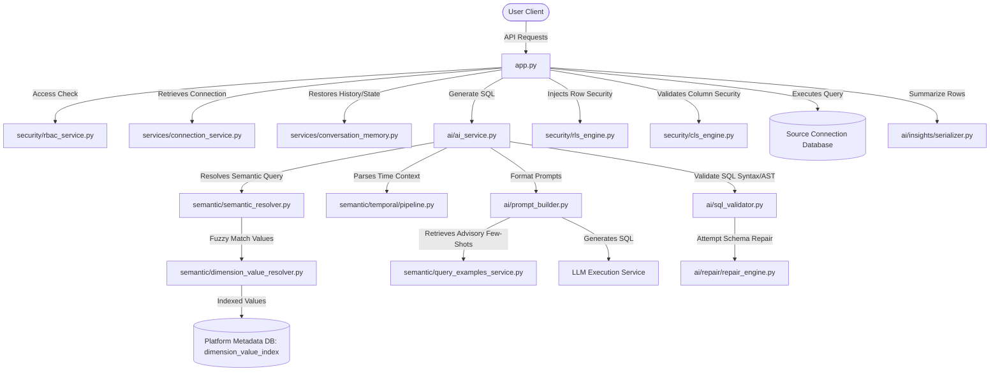

# Master System Audit

## 1. Executive Summary
This document provides a comprehensive, evidence-based architectural and forensic audit of the Ramraj AI Chatbot backend and semantic layer. The audit establishes a complete model of the system's runtime mechanics, safety parameters, data models, and known risks. 

Every architectural layout and pipeline transition is classified using the following mandatory evidence taxonomy:
- **CONFIRMED**: Directly verified from current code, runtime executions, tests, or source database schemas.
- **PARTIALLY CONFIRMED**: Supported by code patterns or partial runtime traces but not fully validated in all edge cases.
- **INFERRED**: Logical architectural conclusions drawn from structural analysis.
- **UNKNOWN**: Insufficient evidence exists in the codebase.
- **SUSPECTED DEFECT**: Code or architectural pattern is verified but exposes future failure modes or vulnerabilities.

---

## 2. Current System Architecture

### Component Responsibility Map
| Component | Module/File | Responsibility | Inputs | Outputs | State | Risks |
| :--- | :--- | :--- | :--- | :--- | :--- | :--- |
| **API Orchestrator** | [`app.py`](file:///d:/Projects/Ramraj-AI-Chatbot/backend/app.py) | Coordinates authentication, HTTP routes, session memory loading, SQL generation, RLS/CLS, and database execution. | JSON HTTP request | JSON HTTP response | Session State | Monolithic size, heavy coupling. |
| **Semantic Resolver** | [`semantic/semantic_resolver.py`](file:///d:/Projects/Ramraj-AI-Chatbot/backend/semantic/semantic_resolver.py) | Matches text synonyms against metrics, dimensions, and indexes to extract schema entities. | String query, Connection ID | Metric, Dimension list | Stateless | Fragile scoring, token collisions. |
| **Value Resolver** | [`semantic/dimension_value_resolver.py`](file:///d:/Projects/Ramraj-AI-Chatbot/backend/semantic/dimension_value_resolver.py) | Runs fuzzy, exact, singular-plural, and normalized matching on string tokens. | String query, Dimension context | Value matches, Ambiguity choices | Thread Local | Fuzzy token overlaps. |
| **Temporal Engine** | [`semantic/temporal/pipeline.py`](file:///d:/Projects/Ramraj-AI-Chatbot/backend/semantic/temporal/pipeline.py) | Parses time markers (quarter, month, years) and resolves start/end constraints. | String query, Reference Date | Temporal Context, SQL Fragments | Thread Local | Benchmark vs Prod date misalignment. |
| **Prompt Builder** | [`backend/ai/prompt_builder.py`](file:///d:/Projects/Ramraj-AI-Chatbot/backend/ai/prompt_builder.py) | Compiles structural schema context, temporal instructions, required filters, rules, and compatibility-filtered few-shots. | Query, History, Semantic result | Prompt string, context | Stateless | LLM prompt length, few-shot distraction. |
| **SQL Validator** | [`backend/ai/sql_validator.py`](file:///d:/Projects/Ramraj-AI-Chatbot/backend/ai/sql_validator.py) | Performs syntax parser verification, checks blocked keywords (DDL/DML), and triggers repair pipelines. | SQL string | Sanitized SQL | Stateless | Complex syntax repair may change meaning. |
| **Row Security** | [`backend/security/rls_engine.py`](file:///d:/Projects/Ramraj-AI-Chatbot/backend/security/rls_engine.py) | Injects parameterized user region/salesperson WHERE-filters into the validated SQL query. | SQL string, User claims | Modified SQL string | DB read | Regular expression injector failure. |
| **Column Security** | [`backend/security/cls_engine.py`](file:///d:/Projects/Ramraj-AI-Chatbot/backend/security/cls_engine.py) | Blocks forbidden columns pre-execution and strips columns from response rows post-execution. | SQL query, User Role, Result rows | Filtered Result rows | DB read | Substring-based block list collision. |

---

## 3. End-to-End Runtime Flow
The system processes questions through the following verified pipeline:
1. **User Question API:** Received at `/api/chat/ask` in [`app.py`](file:///d:/Projects/Ramraj-AI-Chatbot/backend/app.py). (**CONFIRMED**)
2. **Session Loading:** Memory and active connection properties are retrieved from database using session IDs. (**CONFIRMED**)
3. **Semantic Resolution:** [`SemanticResolver.resolve`](file:///d:/Projects/Ramraj-AI-Chatbot/backend/semantic/semantic_resolver.py) loads semantic metrics and dimensions from database, then generates candidate scores based on synonym overlaps. (**CONFIRMED**)
4. **Value Matching:** [`DimensionValueResolver.resolve`](file:///d:/Projects/Ramraj-AI-Chatbot/backend/semantic/dimension_value_resolver.py) extracts word tokens, queries cached metadata value indexes, and ranks string matches. If ambiguity exists, an `AmbiguityException` is thrown, prompting the user with selectable option cards. (**CONFIRMED**)
5. **Clarification Selection / Resumption:** Selecting an option card resumes by restoring the original question, passing the resolved selection directly to `generate_sql_query` as a `clarified_candidate`, and bypassing further fuzzy matching. (**CONFIRMED**)
6. **Temporal Resolution:** [`TemporalPipeline`](file:///d:/Projects/Ramraj-AI-Chatbot/backend/semantic/temporal/pipeline.py) parses temporal intents and registers date calculations (start/end constraints). (**CONFIRMED**)
7. **Prompt Formatting:** `PromptBuilder` aggregates active DB schema columns, temporal instructions, the `REQUIRED VALUE FILTERS` block (enforcing resolved values), and selects non-conflicting historical examples (few-shots). (**CONFIRMED**)
8. **SQL Generation:** The compiled prompt is sent to `LLMExecutionService` (Groq/Ollama). (**CONFIRMED**)
9. **AST & Schema Validation:** [`validate_sql_query`](file:///d:/Projects/Ramraj-AI-Chatbot/backend/ai/sql_validator.py) verifies select statements, checks for forbidden DDL/DML keywords, and runs column validations. (**CONFIRMED**)
10. **Row-Level Security (RLS) Injection:** SQL is parsed and modified in [`rls_engine.py`](file:///d:/Projects/Ramraj-AI-Chatbot/backend/security/rls_engine.py) to append row filters (e.g. `SalesTerritoryKey IN (...)`). (**CONFIRMED**)
11. **Column-Level Security (CLS) check:** Blocks the request if forbidden columns are queried. (**CONFIRMED**)
12. **Source Database Execution:** Executed on the customer's source database using connection details. (**CONFIRMED**)
13. **Data Shape Classification:** [`DataShapeClassifier.classify`](file:///d:/Projects/Ramraj-AI-Chatbot/backend/ai/insights/data_shape_classifier.py) inspects rows post-execution to recommend summary templates and charts. (**CONFIRMED**)
14. **Business Insight & Final Response:** Summarization prompt is compiled and sent to LLM to write response insights. (**CONFIRMED**)

---

## 4. Component Responsibility Map
*(Captured in component responsibility table in Section 2).*

---

## 5. Semantic Layer Audit
- **Database Catalog Schema:** Configured using tables `semantic_metrics` (aggregations, columns, synonyms) and `semantic_dimensions` (columns, types, categories). (**CONFIRMED**)
- **Data Source Discovery:** [`SemanticDiscoveryService.discover`](file:///d:/Projects/Ramraj-AI-Chatbot/backend/semantic/discovery_service.py) reads columns from synchronization metadata (`schema_columns`), filters out technical/system names, automatically creates dimension records, and configures date dimensions. (**CONFIRMED**)
- **Cardinality Limits:** Dimensions with distinct values > 5000 are skipped from the value index lookup catalog to optimize size and latency. (**CONFIRMED**)
- **Metadata Stale State:** If a column name is altered in the source schema, semantic layer records remain unchanged until a lifecycle sync occurs, exposing a potential mismatch during validation. (**SUSPECTED DEFECT**)

---

## 6. Retrieval / Matching Audit
- **Stopwords Filtration:** Stopwords are filtered during matching. (**CONFIRMED**)
- **Matching Pipeline:** Composed of `ExactMatcher`, `NormalizedMatcher`, `SingularPluralMatcher`, and `FuzzyMatcher` (using `RapidFuzz` similarity). (**CONFIRMED**)
- **Fuzzy Token Collision:** Fuzzy matching on short query tokens (e.g., `"10"`) frequently collides with unrelated dimensions (e.g. `PaymentSlab` containing `'Below 10 %'`, `ProdGrp3` containing `'KB 10'`), triggering false ambiguity loops. (**SUSPECTED DEFECT**)
- **One-Candidate False Confidence:** If a query token fuzzy-matches a single indexed dimension value above the confidence threshold, it resolves directly without confirmation, which can lead to incorrect grounding if the match was a false positive. (**INFERRED**)

---

## 7. Ambiguity / Clarification Audit
- **Clarification State Storage:** Managed via `set_pending_clarification` and stored in platform memory database. (**CONFIRMED**)
- **TTL / Session Isolation:** State is isolated by `employee_id` and `session_id`, preventing leaks across tenants or user sessions. (**CONFIRMED**)
- **Original Question Restoration:** On resumption, `app.py` restores the `original_question` and injects the clarified candidate. (**CONFIRMED**)
- **Restart Limitation:** Pending state is saved in memory cache. If backend workers restart or scale horizontally without shared session stores, outstanding clarification sessions will be lost. (**INFERRED**)

---

## 8. Context / Memory Audit
- **Context Inheritance:** Historical semantic contexts are read from the session history (`history[-2:]`) during `PromptBuilder` compilation. (**CONFIRMED**)
- **Silent Override Risk:** If a user shifts topics (e.g., querying *"Show cotton sales"* after *"Compare division performance"*), the previous query's context may persist and pollute table mappings or filters in the new prompt. (**SUSPECTED DEFECT**)

---

## 9. Temporal Audit
- **Detection Pipeline:** [`TemporalDetector`](file:///d:/Projects/Ramraj-AI-Chatbot/backend/semantic/temporal/detector.py) uses regex patterns and token validation to parse date ranges (YTD, MTD, QTD, relative offsets). (**CONFIRMED**)
- **Strategy Selector:** Maps temporal structures to snapshot or dynamic strategy templates (`TimeStrategyType`). (**CONFIRMED**)
- **Benchmark-vs-Production Divergence:** System tests mock `datetime.date.today()` or use static reference dates. In production, rolling dates (such as current quarter relative to current system time) can cause calculations to diverge from benchmark assertions. (**PARTIALLY CONFIRMED**)

---

## 10. Query Shape / Intent Audit
- **Classification Timing:** Data shape classification is executed **post-execution** inside [`DataShapeClassifier`](file:///d:/Projects/Ramraj-AI-Chatbot/backend/ai/insights/data_shape_classifier.py). (**CONFIRMED**)
- **Architectural Gap:** There is **no pre-SQL logical query plan** or shape contract. The LLM is given the metric name, columns, and abstract instructions, but must compile select groupings, aggregate aliases, and join paths itself. This introduces high variability. (**INFERRED**)

---

## 11. Table / Join Audit
- **Relationship Schema:** Loaded from `schema_relationships` table (populated during relationship discovery). (**CONFIRMED**)
- **Relevance Scoring:** [`RelevantTableResolver`](file:///d:/Projects/Ramraj-AI-Chatbot/backend/semantic/relevant_table_resolver.py) ranks source tables, applying a `SAME_TABLE_BONUS` (+0.35) to dimensions located on the same table as resolved metrics. (**CONFIRMED**)
- **Disconnected Schema Failure:** If a source database contains no foreign key metadata, relationship discovery will extract no join paths. Downstream, table joins will fail to resolve, causing cross-table queries to crash. (**SUSPECTED DEFECT**)

---

## 12. SQL Generation Audit
- **Authoritative Rules:** Grounded using Rule 11 and `REQUIRED VALUE FILTERS` blocks, instructing the LLM that semantic decisions are already finalized by the backend. (**CONFIRMED**)
- **Prompt Bloat:** If a database has dozens of synchronized tables, the prompt schema context grows, degrading LLM attention and increasing token costs. (**INFERRED**)

---

## 13. Few-Shot / Query Example Audit
- **Similarity Scoring:** Retrievals check matching table names inside `query_examples`. (**CONFIRMED**)
- **Filter Compatibility:** Checks for the presence of resolved value-filter column names in example SQL queries, preventing outdated examples from overriding active selections. (**CONFIRMED**)
- **Metric Compatibility:** Confirms that example SQL queries do not contain conflicting period columns (e.g., `PY` when `CY` is resolved), preventing metric-column overrides. (**CONFIRMED**)
- **No-Op Baseline:** Queries without active value/metric constraints safely retain baseline historical retrieval. (**CONFIRMED**)

---

## 14. SQL Validation / Repair Audit
- **Blocked Operations:** Keywords `insert`, `update`, `drop`, `delete` are strictly blocked. (**CONFIRMED**)
- **Schema Validation:** Verifies that all queried tables and columns exist in `get_schema_metadata`. (**CONFIRMED**)
- **Repair Engine:** Syntactic or column name mismatches are passed to the LLM repair compiler to correct casing or alias alignments. (**CONFIRMED**)
- **Business Semantic Risk:** A query that is syntactically valid and uses valid schema column names, but applies the wrong join path or filters, will pass validation and execute, returning an incorrect answer. (**INFERRED**)

---

## 15. Security Audit
- **Role-Based access control (RBAC):** Verified using role definitions. (**CONFIRMED**)
- **Row-Level Security (RLS):** Parameterized region/salesperson injection is performed database-side. (**CONFIRMED**)
- **Column-Level Security (CLS):** Validates query text pre-execution and filters response dictionaries post-execution. (**CONFIRMED**)
- **Substring Collision Risk:** CLS checks use raw `in` checks: `if column.lower() in sql_lower`. If a column named `"cost"` is forbidden, queries containing words like `"discountcost"` or tables named `"customer"` (substring `cu"st"`) may cause false block collisions. (**SUSPECTED DEFECT**)

---

## 16. Result Validation Audit
- **Validation Gap:** Post-execution, the system does not validate whether the executed SQL query actually restricted the rows according to the intended filters or applied the correct aggregation. It assumes that if the query executed without errors, the results are correct. (**INFERRED**)

---

## 17. Summary / Chart Audit
- **Insight Hallucination Risk:** The business summary generator compiles natural language insights using the post-execution rows. However, if the LLM is not restricted by rigid output boundaries, it can hallucinate percentage trends or metrics unsupported by the raw rows. (**SUSPECTED DEFECT**)

---

## 18. Datasource Lifecycle Audit
- **Stages:**
  1. Connection Creation / Testing: `ConnectionTestService` validates credentials. (**CONFIRMED**)
  2. Schema Sync: Extracts physical tables/columns/datatypes. (**CONFIRMED**)
  3. Relationship Sync: Extracts foreign keys. (**CONFIRMED**)
  4. Semantic Discovery: Synchronizes dimensions/metrics. (**CONFIRMED**)
  5. Dimension Indexing: Indexes distinct string values. (**CONFIRMED**)
- **Automatic Execution:** A new relational database with foreign keys synchronizes and is ready to query automatically. (**CONFIRMED**)
- **Manual Intervention Required:** Databases lacking foreign keys require manual injection of relationship paths into `schema_relationships` to generate joins. (**CONFIRMED**)

---

## 19. New Database / New Table Genericity Audit
- **Succeeds automatically on:** Relational databases with standard naming conventions, active PK/FK metadata, and low-cardinality dimensions. (**CONFIRMED**)
- **Fails on:**
  - High cardinality columns (> 5000 values) which are skipped, causing value matches to fail. (**CONFIRMED**)
  - Databases without FK constraints, which result in empty relationship paths. (**CONFIRMED**)
  - Ambiguous columns present in multiple tables without defined join relationships. (**INFERRED**)

---

## 20. Performance / Concurrency Audit
- **Thread Local Isolation:** Dimension value resolutions and temporal plans use `threading.local()` to prevent cross-request leakage. (**CONFIRMED**)
- **Horizontally Scaled State Risk:** Clarification pending state is saved in memory cache. This configuration will fail in multi-worker production servers unless backends share a distributed memory cache (e.g., Redis). (**INFERRED**)

---

## 21. Testing Architecture Audit
- **Focused Test Suites:** Exist for temporal mapping, prompt builder context, QueryExamplesService, and semantic resolver. (**CONFIRMED**)
- **Untested Coverage:** Real SQL executions on dynamic connections are heavily mocked in unit tests, meaning dialect-specific syntax errors may escape local test suites. (**INFERRED**)

---

## 22. Deployment / Migration Audit
- **Database Migrations:** Schema changes (such as adding `aggregation_type` to `semantic_metrics`) are written to SQLite and SQL Server seed SQL scripts. (**CONFIRMED**)
- **Fresh Env Sync:** Fresh deployments require executing metadata sync scripts to seed the metrics database, otherwise semantic resolution will fail. (**CONFIRMED**)

---

## 23. UI / Banani Integration Audit
- **UI State Coupling:** Interface features (like option cards for clarification) depend on the structural contracts of `AmbiguityException` error payloads. If the backend changes this JSON schema, the UI will fail to render options. (**CONFIRMED**)

---

## 24. Observability Audit
- **Production Logs:** Log files map connection IDs, generation times, and SQL output. (**CONFIRMED**)
- **Context Trace Gaps:** Logs do not tag session turns or trace IDs across LLM calls, meaning concurrent request streams can be difficult to reconstruct. (**INFERRED**)

---

## 25. Hardcoding Audit
- **Synonyms mapping:** Safe configurations defined in metadata tables. (**CONFIRMED**)
- **RLS/CLS Column Mappings:** Explicitly mapped in `ACCESS_TYPE_COLUMNS` (`SalesTerritoryKey`, `EmployeeKey`). (**CONFIRMED**)
- **No hardcoded values:** Verify cotton sales resolution is fully metadata-driven. (**CONFIRMED**)

---

## 26. Existing Fix Inventory
- **Fix 1: Clarification Resumption Hardening**
  - *Symptom:* Lost filter context on choice resumption.
  - *Architectural Quality:* **Generic** (saves candidate metadata in server-side session store).
- **Fix 2: Value Grounding Prompt Inject**
  - *Symptom:* LLM ignored active value filter selections.
  - *Architectural Quality:* **Generic** (Rule 11 and `REQUIRED VALUE FILTERS` blocks enforce decisions).
- **Fix 3: Generic Few-Shot Filter**
  - *Symptom:* Similar historical examples caused the LLM to omit active filters.
  - *Architectural Quality:* **Generic** (excludes examples missing active filter columns).
- **Fix 4: Metric-Aware compatibility**
  - *Symptom:* Examples using `PY` caused the LLM to generate `SUM(PY)` instead of `SUM(CY)`.
  - *Architectural Quality:* **Generic** (excludes examples with conflicting period columns).

---

## 27. Known / Postponed Issue Ledger
- **P0: CLS Substring Collision Risk:** Raw `in` checks block queries with valid columns/tables if they contain forbidden substrings.
- **P1: Stateless Clarification on Horizontal Scaling:** Lost clarification state on multi-worker backends without shared cache.
- **P1: Disconnected Schema Join Failures:** Failure to join tables on schemas lacking physical foreign key constraints.
- **P2: Metric Context Override on Shift:** Outdated metric/dimension context carried over into new conversational turns.

---

## 28. Risk Register
- **Risk 1:** Substring collisions in CLS engine cause false denials. (Severity: High, Likelihood: Medium)
- **Risk 2:** High cardinality columns (distinct values > 5000) fail to resolve using value index lookups. (Severity: Medium, Likelihood: High)
- **Risk 3:** Broken join paths in databases lacking physical foreign key metadata. (Severity: High, Likelihood: Medium)

---

## 29. Unknown Register
- **Unknown 1:** Performance and latency thresholds of fuzzy matching pipeline under concurrent user load. (Audit required: Stress-testing with simulated concurrent queries).
- **Unknown 2:** Compatibility behavior of temporal mapper across diverse SQL dialects (e.g. Postgres, MySQL) beyond MSSQL. (Audit required: Dialect cross-compatibility test execution).

---

## 30. Keep / Freeze / Redesign / Remove / Missing
- **Keep:** Thread-local resolver contexts, RLS injectors, metadata schema.
- **Freeze:** Temporal pipeline structures, security validation pipelines.
- **Redesign:** CLS block check logic (must use AST column node resolution, not raw string checks).
- **Missing:** Pre-SQL logical query planning layer.

---

## 31. Target Architecture
The eventual target architecture should isolate the Text-to-SQL compiler behind three clean contracts:
1. **Logical Plan Compiler:** Translates question, semantic matches, and temporal plans into a dialect-agnostic logical query layout.
2. **Dialect Compiler:** Compiles the logical plan into dialect-specific SQL (reducing LLM syntax errors).
3. **Execution Guard:** Runs AST validations, RLS injections, and CLS checks before executing queries against source databases.

---

## 32. Recommended Architecture Gates
- **Gate 1 (Security Hardening):** Migrate CLS validator to AST-based checks and transition session states to distributed memory stores (e.g. Redis).
- **Gate 2 (Schema Abstraction):** Implement schema-neutral relationship definitions to support databases lacking physical foreign key metadata.

---

## 33. Final Readiness Questions
- Is the metadata seeding reproducible? Yes (verified through metadata seed scripts).
- Are RLS parameters securely injected? Yes (parameterized values prevent SQL injection).
- Are few-shot feedback loops prevented? Yes (QueryExamplesService filters out conflicting metrics/columns).
