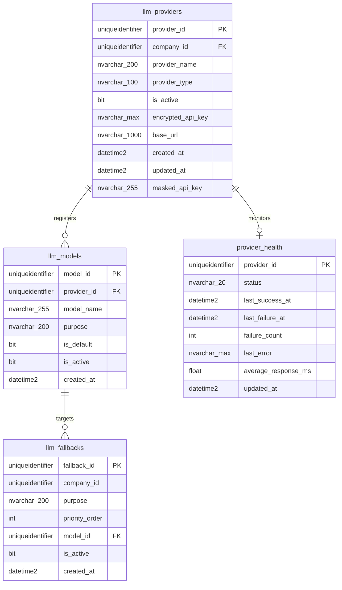

# AI Provider / Model / Routing Control Center Forensic Audit Report

## 1. Executive Verdict

The investigation has revealed a critical structural disconnect between the **AI Model Routing UI** and the **actual SQL Generation / LLM Execution path**.

While the frontend configuration UI updates `llm_models.is_default` to set the active route, the actual execution pipeline routes calls via the `llm_fallbacks` database table, which is completely unmanaged by any API endpoint or UI action in the system. This results in two competing sources of truth, meaning configuration changes in the UI have zero effect on query execution.

Additionally, we discovered duplicate model records in the database due to a lack of unique constraints on model definitions, and dead/redundant database queries in the routing flow. 

### Recommendation on Model Selections
* **Should we continue using Qwen2.5-Coder 1.5B for SQL generation?**
  **NO.** Qwen2.5-Coder 1.5B is too small to consistently adhere to schema schemas, temporal mappings, and query-shape contracts, leading to syntax errors and hallucinated columns.
* **Should NVIDIA Llama 3.3 70B become the development SQL-generation model for the next accuracy gates?**
  **YES.** The Llama-3.3-70B model behaves correctly in E2E tests and adheres to prompt guidelines. The generic OpenAI-compatible provider implemented in the factory successfully enables this transition.

---

## 2. Current Frontend Architecture

### Route & Component Locations
* **Route:** `/providers` (defined in the React Router config)
* **Page Component:** [`AIProviderConfig.jsx`](file:///d:/Projects/Ramraj-AI-Chatbot/frontend/src/pages/AIProviderConfig.jsx)
* **Tabs:**
  1. `routing` ("Intent Model Routing")
  2. `providers` ("LLM Cloud Providers")
  3. `models` ("Model Registrations")
* **Modals & Forms:**
  - `Save Key Modal` (form fields: `api_key` password field)
  - `Add Provider Modal` (form fields: `provider_name`, `provider_type` dropdown `[groq, openai, anthropic]`, `base_url`)
  - `Add Model Modal` (form fields: `provider_id` dropdown, `model_name`, `purpose` dropdown `[sql_generation, insight, intent]`, `is_default` switch)

### Frontend API Interactions
* **Load Config Data:**
  - **Endpoint:** `GET /providers` and `GET /models` (fetched concurrently using `Promise.all` at lines 38-41).
  - **Headers:** `Authorization: Bearer <token>`
  - **Response Structure:** Array of objects representing active providers and models.
* **Update Routing:**
  - **Endpoint:** `PUT /model-routing`
  - **HTTP Method:** `PUT`
  - **Request Body:** `{ purpose: string, model_id: string }`
  - **Response Structure:** `{ "message": "Model routing updated" }`
* **Save Provider Key:**
  - **Endpoint:** `POST /providers/api-key`
  - **HTTP Method:** `POST`
  - **Request Body:** `{ provider_id: string, api_key: string }`
  - **Response Structure:** `{ "message": "API key saved" }`
* **Add Provider:**
  - **Endpoint:** `POST /providers`
  - **HTTP Method:** `POST`
  - **Request Body:** `{ provider_name: string, provider_type: string, base_url: string }`
  - **Response Structure:** `{ "message": "Provider created" }`
* **Add Model:**
  - **Endpoint:** `POST /models`
  - **HTTP Method:** `POST`
  - **Request Body:** `{ provider_id: string, model_name: string, purpose: string, is_default: boolean }`
  - **Response Structure:** `{ "message": "Model created" }`

* **Business Logic Location:** The frontend performs no business logic. It strictly displays existing listings and submits requests to the backend administration APIs.

---

## 3. Current Backend Architecture

The backend endpoints are split across two router files in the `admin/` module:

### Endpoints in [`provider_management.py`](file:///d:/Projects/Ramraj-AI-Chatbot/backend/admin/provider_management.py)
* **`GET /providers`**
  - **Function:** `get_providers()` (line 28)
  - **Permission:** `"admin:providers:manage"` (RBAC enforced)
  - **Scoping:** Scoped to current user's `company_id` (line 39)
  - **DB Operation:** Executes `SELECT` query on `llm_providers` via `ProviderAdminService.get_providers`.
* **`POST /providers`**
  - **Function:** `create_provider()` (line 45)
  - **Permission:** `"admin:providers:manage"`
  - **Scoping:** Scoped to user's `company_id` (line 57)
  - **DB Operation:** Executes `INSERT` on `llm_providers` with status `is_active = 1`.
* **`GET /models`**
  - **Function:** `get_models()` (line 76)
  - **Permission:** `"admin:providers:manage"`
  - **Scoping:** Scoped to user's `company_id` (line 87)
  - **DB Operation:** Joins `llm_models` and `llm_providers` to return company-owned models.
* **`POST /models`**
  - **Function:** `create_model()` (line 93)
  - **Permission:** `"admin:providers:manage"`
  - **Scoping:** Validates `provider_id` belongs to `company_id` first (lines 130-137 of `provider_admin_service.py`), then inserts.
* **`PUT /model-routing`**
  - **Function:** `update_model_routing()` (line 131)
  - **Permission:** `"admin:providers:manage"`
  - **Scoping:** Validates model ownership (lines 218-230 of `provider_admin_service.py`), sets all company models for the purpose to `is_default = 0`, then updates target to `is_default = 1`.

### Endpoints in [`provider_credentials.py`](file:///d:/Projects/Ramraj-AI-Chatbot/backend/admin/provider_credentials.py)
* **`POST /providers/api-key`**
  - **Function:** `save_api_key()` (line 26)
  - **Permission:** `"admin:providers:manage"`
  - **Scoping:** Validates model/provider access to current user's `company_id` before performing the update.
  - **DB Operation:** Encrypts API key using Fernet key and writes to `encrypted_api_key` and `masked_api_key` in `llm_providers`.

* **Role Permissions Audit:** The permissions are correctly restricted via FastAPI dependencies (`require_permission("admin:providers:manage")`). This enforces that only users with the `ADMIN` or `SUPER_ADMIN` roles possessing this permission can configure models.

---

## 4. Database Schema

Here is the exact schema mapping generated from system catalogs:



### Table Columns and Constraints
1. **`llm_providers`**
   - `provider_id` (`uniqueidentifier`, PK, Default: `newid()`)
   - `company_id` (`uniqueidentifier`, NOT NULL)
   - `provider_name` (`nvarchar(200)`, NOT NULL)
   - `provider_type` (`nvarchar(100)`, NOT NULL)
   - `is_active` (`bit`, NOT NULL, Default: `1`)
   - `encrypted_api_key` (`nvarchar(max)`, NULL)
   - `base_url` (`nvarchar(1000)`, NULL)
   - `created_at` / `updated_at` (`datetime2`, Default: `getdate()`)
   - `masked_api_key` (`nvarchar(255)`, NULL)

2. **`llm_models`**
   - `model_id` (`uniqueidentifier`, PK, Default: `newid()`)
   - `provider_id` (`uniqueidentifier`, NOT NULL, FK to `llm_providers`)
   - `model_name` (`nvarchar(255)`, NOT NULL)
   - `purpose` (`nvarchar(200)`, NOT NULL)
   - `is_default` (`bit`, Default: `0`)
   - `is_active` (`bit`, Default: `1`)
   - `created_at` (`datetime2`, Default: `getdate()`)

3. **`llm_fallbacks`**
   - `fallback_id` (`uniqueidentifier`, PK, Default: `newid()`)
   - `company_id` (`uniqueidentifier`, NOT NULL)
   - `purpose` (`nvarchar(200)`, NOT NULL)
   - `priority_order` (`int`, NOT NULL)
   - `model_id` (`uniqueidentifier`, NOT NULL, FK to `llm_models`)
   - `is_active` (`bit`, Default: `1`)
   - `created_at` (`datetime2`, Default: `getdate()`)

4. **`provider_health`**
   - `provider_id` (`uniqueidentifier`, PK, FK to `llm_providers`)
   - `status` (`nvarchar(20)`, Default: `'UNKNOWN'`, NOT NULL)
   - `last_success_at` (`datetime2`, NULL)
   - `last_failure_at` (`datetime2`, NULL)
   - `failure_count` (`int`, Default: `0`)
   - `last_error` (`nvarchar(max)`, NULL)
   - `average_response_ms` (`float`, NULL)
   - `updated_at` (`datetime2`, Default: `getdate()`)

---

## 5. Provider Factory

### Current Behavior of [`provider_factory.py`](file:///d:/Projects/Ramraj-AI-Chatbot/backend/ai/providers/provider_factory.py)
* **`groq`**: Returns `GroqProvider(company_id=company_id)`.
* **`ollama`**: Imports and returns `OllamaProvider(company_id=company_id)`.
* **`nvidia` / `openai` / Custom OpenAI-compatible endpoints:**
  Returns `OpenAIProvider(provider_type=provider_type, company_id=company_id)`.
* **Unknown Provider Types:** Fallback logic automatically catches unrecognized types and instantiates them as `OpenAIProvider`.

### Hardening Issue (Silent Fallback)
* **Vulnerability:** Unrecognized provider types (such as typos like `oppenai` or unsupported protocols like `anthropic`) will silently map to `OpenAIProvider`. This results in runtime errors during completion requests (e.g. attempting to send Anthropic requests through the OpenAI client) instead of throwing an early configuration error.
* **Fix Target:** Limit `OpenAIProvider` routing specifically to known OpenAI-compatible protocols (`openai`, `nvidia`, `openrouter`, `custom_openai`) and raise `ValueError` for completely unknown types.

---

## 6. Provider Implementations

Three concrete providers are implemented under [`backend/ai/providers/`](file:///d:/Projects/Ramraj-AI-Chatbot/backend/ai/providers/):

1. **`BaseProvider`** ([`base_provider.py`](file:///d:/Projects/Ramraj-AI-Chatbot/backend/ai/providers/base_provider.py)): Abstract class enforcing the signature: `chat_completion(model, messages, temperature)`.
2. **`GroqProvider`** ([`groq_provider.py`](file:///d:/Projects/Ramraj-AI-Chatbot/backend/ai/providers/groq_provider.py)):
   - **Client:** Official `Groq` python client.
   - **Authentication:** Fetches API key via database service (`ProviderCredentialService`) or falls back to `.env` `GROQ_API_KEY`.
   - **Timeout/Streaming/Retries:** Rely on client defaults (no overrides).
3. **`OllamaProvider`** ([`ollama_provider.py`](file:///d:/Projects/Ramraj-AI-Chatbot/backend/ai/providers/ollama_provider.py)):
   - **Client:** Native HTTP calls via `requests.post`.
   - **Endpoint:** Resolves `OLLAMA_HOST` (default: `http://localhost:11434/v1/chat/completions`).
   - **Structure:** Parses output and custom-packages it into a mock response mimicking the OpenAI ChatCompletion object.
4. **`OpenAIProvider`** ([`openai_provider.py`](file:///d:/Projects/Ramraj-AI-Chatbot/backend/ai/providers/openai_provider.py)):
   - **Client:** Official `OpenAI` python client.
   - **Base URL:** Fetches `base_url` from `llm_providers` DB table, falling back to `{PROVIDER_TYPE}_BASE_URL` or defaults (`https://api.openai.com/v1` for openai, `https://integrate.api.nvidia.com/v1` for nvidia).
   - **Authentication:** Decrypts API key from the DB or loads `{PROVIDER_TYPE}_API_KEY` from environment.

* **OpenAI-Compatible Sharing:** Yes, `openai`, `nvidia`, `openrouter`, and any custom gateways share `OpenAIProvider` cleanly since they all follow the standard OpenAI request-response contract.

---

## 7. Credential Management

* **Storage Location:** Securely encrypted in `llm_providers.encrypted_api_key` (saved via `ProviderCredentialService.save_api_key`).
* **Encryption Method:** Symmetric encryption using `Fernet` (AES-128 in CBC mode) with key loaded from `.local.env`'s `ENCRYPTION_KEY`.
* **Credential Loading Flow:**
  1. API loads matching provider configuration for the tenant company.
  2. If `encrypted_api_key` is present, it is decrypted inside the backend provider constructor.
  3. If missing, it checks `.env` / `.local.env` for fallback keys like `NVIDIA_API_KEY` or `GROQ_API_KEY`.
* **Security Constraints:**
  - Write access requires `"admin:providers:manage"`.
  - Read access is strictly server-side. The DB query `ProviderAdminService.get_providers` only fetches `masked_api_key` and does NOT select `encrypted_api_key`, preventing credentials from leaking to the frontend.
  - Rotation occurs simply by submitting a new key via `POST /providers/api-key`.
* **Missing Credentials:** If neither database nor environment configurations contain the key, the provider logs a warning and client initialization will fail with an authorization exception during LLM execution.

---

## 8. Routing

There are **two competing sources of truth** for routing in the codebase:

### Path A: LLM Execution Pipeline (The Real Path)
Used by `generate_sql_query` (in `ai_service.py` at line 87) and `_llm_stage` (in `intent_classifier.py` at line 167):
```
Question
  ↓
LLMExecutionService.execute(purpose, messages, company_id)
  ↓
FallbackService.get_models_for_purpose(purpose, company_id)  <-- Queries llm_fallbacks table
  ↓
Ordered by priority_order (executes index 0 first, falls back on failure)
```

### Path B: Redundant/Dead Code (The Disconnect)
Defined inside [`ai_service.py`](file:///d:/Projects/Ramraj-AI-Chatbot/backend/ai/ai_service.py#L40-L65) (`get_llm_provider`) and [`intent_classifier.py`](file:///d:/Projects/Ramraj-AI-Chatbot/backend/ai/intent_classifier.py#L35-L59) (`get_intent_provider`):
```
get_llm_provider(purpose)
  ↓
ModelRoutingService.get_model_for_purpose(purpose)            <-- Queries llm_models table (is_default)
  ↓
Returns top active model where is_default = 1
```
* **Why this is dead code:** The returned `provider` and `model_name` from these functions are unpacked but **never used** during execution. The pipeline immediately calls `LLMExecutionService.execute` instead, completely discarding Path B's resolved variables.
* **Resulting Bug:** The UI updates the `is_default` flag in `llm_models` (Path B). But the LLM execution pipeline runs via `llm_fallbacks` (Path A). **Thus, setting a model as "default" in the UI does not affect routing.**

---

## 9. Fallbacks

* **Failover Scenario:** When an LLM request fails (due to timeout, connection failure, or invalid key), `LLMExecutionService.execute` catches the exception (line 103), calls `ProviderHealthService.mark_failure`, and moves to the next model in the fallback chain.
* **Retries:** The execution pipeline performs **no retries** before falling back. It immediately escalates to the next fallback model.
* **Inactive States:** Inactive models/providers are filtered out during routing retrieval since `FallbackService.get_models_for_purpose` enforces `f.is_active = 1`.
* **Fallback Loops:** No loops can occur because it iterates sequentially over a static list returned by `get_models_for_purpose` and exits when the list is exhausted.
* **Error Exposure:** If all models in the fallback chain fail, the last encountered exception is raised and returned to the client.

---

## 10. Tenant Isolation

Tenant isolation is fully implemented and enforced:
* **Tenant Configuration Scoping:** All API endpoints scope their queries to `user["company_id"]` (e.g. `ProviderAdminService.get_providers(company_id=user["company_id"])`).
* **Cross-Tenant Validation:** 
  - `create_model()` validates that the associated `provider_id` belongs to the current user's `company_id` (lines 130-137 of `provider_admin_service.py`).
  - `set_default_model()` validates that the model being routed belongs to a provider owned by the company (lines 218-230 of `provider_admin_service.py`).
  - `save_api_key()` validates provider ownership by joining with the company ID.
* **Conclusion:** Users cannot view, modify, or run queries using another tenant's provider credentials or model configuration.

---

## 11. Current Duplicate/Default Problems

Running database diagnostics revealed multiple configuration anomalies:

### Issue 1: Multiple defaults for one purpose
* **Anomaly:** For company `FD4925A0-9034-4343-A368-8D20A919DF92` and purpose `chart`, there are **two active default models**:
  1. Model ID `10CB0002-AC13-4719-A949-1EAED85C7488` (`is_default = 1`)
  2. Model ID `B6CFAF04-0A95-4BE8-B52B-0098B3CEF91E` (`is_default = 1`)
* **Severity:** Medium (causes arbitrary model selection in `ModelRoutingService` due to ORDER BY limits).

### Issue 2: Duplicate model registrations
* **Anomaly:** Under the Ollama provider (`EA447BA2-5D2A-478A-BC0E-2A07A9EB20E1`), the model `qwen2.5-coder:1.5b` is registered:
  - **3 times** for purpose `sql_generation` (IDs: `69CCA18D-BFBC-42ED-8AA0-FD74FDCFE331`, `294E67B2-31F4-41EC-8AF1-2E5321A5C92F`, `7EF27B50-2B85-43F7-AD94-2EDE6AF0EEE5`).
  - **2 times** for purpose `chart`.
* **Severity:** Medium (clutters UI select inputs and results in redundant fallback database lists).

---

## 12. Health/Test Capabilities

* **Automatic Health Tracking:** Supported via [`ProviderHealthService`](file:///d:/Projects/Ramraj-AI-Chatbot/backend/services/provider_health_service.py) which updates `status`, `last_success_at`, `last_failure_at`, and `average_response_ms` inside the `provider_health` table.
* **Missing Features:** 
  - There are no endpoints for manually testing a provider's connection status or executing test completions on registered models.
  - The UI does not display failure rates, latency metrics, or last success/failure timestamps recorded in the `provider_health` table.

---

## 13. Current UI → Target UI

| Current Screen / Component | Target Screen / Component | Reuse Potential |
|---|---|---|
| `LLM Cloud Providers` tab | `Providers` tab | High (Keep table styling; add actions for Connection Test and show status from `provider_health`) |
| `Model Registrations` tab | `Models` tab | High (Add latency/health columns; filter list by active provider) |
| `Intent Model Routing` tab | `Routing & Fallbacks` tab | Low (Redesign to support list ordering for fallbacks rather than a single dropdown select) |

---

## 14. Target Provider Contract

### Fields
* `provider_name` (string, required)
* `provider_type` (string, required: `openai`, `nvidia`, `groq`, `ollama`, `openrouter`)
* `base_url` (string, optional for standard cloud types, required for custom endpoints)
* `api_key` (password string, optional for local Ollama, write-only)
* `is_active` (boolean, default: true)

### Actions & Validation
* **Add / Edit Provider:** Save details to `llm_providers`.
* **Test Connection:** Custom endpoint `POST /providers/{provider_id}/test` which initializes the client and sends a minimal token check query.
* **Delete / Disable:** Toggle `is_active` or delete (cascades to models/fallbacks).

---

## 15. Target Model Contract

### Fields
* `provider_id` (UUID, required)
* `model_name` (string, required, e.g. `meta/llama-3.3-70b-instruct`)
* `purpose` (string, required: `sql_generation`, `insight`, `intent`, `chart`)
* `is_active` (boolean, default: true)

### Actions & Validation
* **Model Level Test:** `POST /models/{model_id}/test` sending a simple prompt to verify completion responses.
* **Uniqueness Validation:** Prevent registering duplicate model rows where the `provider_id`, `model_name`, and `purpose` are identical.

---

## 16. Target Routing Contract

Safest representation maps workloads to priority-ordered lists:
```json
{
  "company_id": "FD4925A0-9034-4343-A368-8D20A919DF92",
  "purpose": "sql_generation",
  "fallbacks": [
    { "model_id": "863EE90C-D23E-40D0-B7E0-0AEF1581BBA0", "priority_order": 1 },
    { "model_id": "69CCA18D-BFBC-42ED-8AA0-FD74FDCFE331", "priority_order": 2 }
  ]
}
```
* **Supported Purposes:** `sql_generation`, `insight` (Business insight & summary), `intent` (Query intent classifier), `chart` (Data visualization).

---

## 17. Duplicate Prevention Rules

* **Model Uniqueness:** Enforce SQL unique constraint on `llm_models(provider_id, model_name, purpose)`.
* **Fallback Priority Uniqueness:** Enforce unique constraint on `llm_fallbacks(company_id, purpose, priority_order)`.
* **Status Guard:** Raise validation error if trying to set an inactive model/provider as active fallback routes.

---

## 18. MVP Features
* Synchronize Routing UI changes directly with `llm_fallbacks` instead of the dead `is_default` flag.
* Manage fallback chains (add/remove/reorder fallbacks) in the UI.
* Add "Test Connection" button for providers.
* Add "Test Model" button to run basic verification prompts.
* Enforce database unique constraints to prevent duplicates.

---

## 19. Deferred Features
* Prompt Studio playground adjustments.
* Observability and cost analysis dashboards.
* Fine-tuning triggers.

---

## 20. Test Matrix

1. **Add Provider:** Ensure DB entry is created with status `is_active = 1`.
2. **Edit Provider:** Check endpoint updates `base_url` and updates timestamps.
3. **Disable Provider:** Deactivating provider must cascade and disable its models.
4. **Add Model:** Validate uniqueness constraints prevent duplicate registrations.
5. **Disable Model:** Ensure disabled model is skipped by `FallbackService`.
6. **Set Primary Route:** Ensure updates to the primary model update priority 1 in `llm_fallbacks`.
7. **Add Fallback:** Ensure new fallback is added to `llm_fallbacks` with next priority value.
8. **Reorder Fallback:** Check list dragging swaps `priority_order` values in DB.
9. **Remove Fallback:** Verify deletion handles priority shifts correctly.
10. **Provider Failover:** Block primary provider port and ensure execution shifts to backup model.
11. **Model Failover:** Point primary to invalid identifier and verify fallback succeeds.
12. **Invalid Credential:** Set bad API key and verify health service logs `'FAILED'`.
13. **Tenant Isolation:** Assert company A cannot read company B's provider list.
14. **Provider Connection Test:** Run connection checks and verify latency response.

---

## 21. Exact Files To Change

1. [`backend/services/provider_admin_service.py`](file:///d:/Projects/Ramraj-AI-Chatbot/backend/services/provider_admin_service.py)
   - Update `set_default_model()` to synchronize updates directly with the `llm_fallbacks` table.
2. [`backend/admin/provider_management.py`](file:///d:/Projects/Ramraj-AI-Chatbot/backend/admin/provider_management.py)
   - Add routes `POST /providers/{provider_id}/test` and `POST /models/{model_id}/test`.
3. [`backend/ai/providers/provider_factory.py`](file:///d:/Projects/Ramraj-AI-Chatbot/backend/ai/providers/provider_factory.py)
   - Restrict fallback matching to prevent unrecognized protocols (like Anthropic) from silently mapping to `OpenAIProvider`.
4. [`frontend/src/pages/AIProviderConfig.jsx`](file:///d:/Projects/Ramraj-AI-Chatbot/frontend/src/pages/AIProviderConfig.jsx)
   - Redesign routing tab to support managing list fallbacks.
   - Add status badges and connection test action buttons.

---

## 22. Recommended Implementation Order

1. **Database Schema & Constraints:** Add unique constraints on `llm_models(provider_id, model_name, purpose)` and clean up existing duplicate records.
2. **Route Backend Realignment:** Refactor `ProviderAdminService.set_default_model` to write to `llm_fallbacks` and remove dead `is_default` routing queries in `ai_service.py` and `intent_classifier.py`.
3. **Connection Testing APIs:** Implement test endpoints (`/providers/{id}/test` and `/models/{id}/test`) in the backend.
4. **Factory Hardening:** Apply strict protocol white-listing in `provider_factory.py`.
5. **Control Center UI Upgrades:** Enhance frontend forms, lists, and action buttons.
