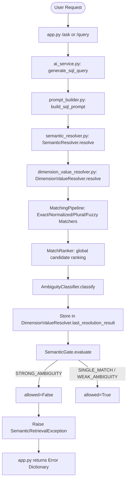

# Phase 1D.2.D — Clarification Contract Audit & Design

This document audits the current semantic ambiguity implementation and designs a production-grade backend clarification contract to handle `STRONG_AMBIGUITY` cases without silent intent dropping.

---

## 1. End-to-End Pipeline Trace

The current execution flow proceeds as follows when a user query is sent:



### Trace Components:
1.  **`app.py`**: Invokes `get_history(employee_id, session_id)` and calls `generate_sql_query()`.
2.  **`ai_service.py`**: Calls `build_sql_prompt()`, wraps any raised `EnterpriseException` (including `SemanticRetrievalException`), and returns `.to_dict()`.
3.  **`prompt_builder.py`**: Triggers `SemanticResolver.resolve()` and evaluates `SemanticGate.evaluate(semantic_result)`. If `allowed` is `False`, it raises a `SemanticRetrievalException`.
4.  **`semantic_resolver.py`**: Loads table metadata, performs overlaps cleanup, and calls `DimensionValueResolver.resolve()`.
5.  **`dimension_value_resolver.py`**: Runs the matching pipeline, ranks candidates globally, and executes `AmbiguityClassifier.classify(matches, q_tokens)`.
6.  **`AmbiguityClassifier`**: Determines the `ResolutionStatus`. Under `STRONG_AMBIGUITY`, it returns a `SemanticResolutionResult` with a list of `AmbiguityChoice` items and a `None` dominant match.
7.  **`SemanticGate`**: Intercepts `STRONG_AMBIGUITY` and returns `allowed: False` with status `"STRONG_AMBIGUITY"`.

---

## 2. Real-Data Ambiguity Audit

Based on running the verification script against the active database index, the following information is structured and returned under `STRONG_AMBIGUITY` for key queries:

| Query | Status | Candidates Found | Ambiguity Dimension Overlap |
| :--- | :--- | :--- | :--- |
| **`pant`** | `STRONG_AMBIGUITY` | `B--PANT` (ProdGrp2), `LS PANT` (ProdGrp2), `LINEN PANT` (Brand), `RAMRAJ PANT` (Brand), etc. | Cross-dimension & same-dimension ambiguity (`Brand`, `ProdGrp2`, `ProdGrp1`). |
| **`shirt`** | `STRONG_AMBIGUITY` | `C--SHIRT` (ProdGrp2), `ADD SHIRT` (Brand), `VIVEAGA SHIRT` (ProdGrp1), etc. | Multi-dimension collision. |
| **`formal shirt`**| `STRONG_AMBIGUITY` | `FORMAL SOCKS DESIGN FULL` (ProdGrp3), `VIVEAGHAM COLOUR SHIRT` (Brand) | Term mismatch and phonetic overlap. |
| **`cotton pant`** | `STRONG_AMBIGUITY` | `LS PANT`, `LINEN PANT`, `RAMRAJ PANT` (on "pant"), `WHITE SHIRT 100% COTTON` (on "cotton") | Multi-token mapping collision. |
| **`banian`** | `STRONG_AMBIGUITY` | `BANIANS` (ProdGrp1), `1 BANIAN` (ProdGrp2), `ADVERTISEMENT BANIAN` (ProdGrp3) | Same-stem collision across dimensions. |
| **`banians`** | `WEAK_AMBIGUITY` | `BANIANS` (ProdGrp1) dominates due to Exact/Normalized confidence gap. | Resolved to dominant match. |
| **`children wear`**| `SINGLE_MATCH` | `N--NIGHT WEARS` (ProdGrp2) | Partial match allowed downstream. |
| **`red shirt`** | `STRONG_AMBIGUITY` | `REDKA` (on "red"), `B N REDDY NAGAR` (on "red"), shirt candidates | High noise collision. |

### Available Structured Information:
For every candidate inside `last_resolution_result.candidates`:
*   `value` (e.g. `"LINEN PANT"`)
*   `normalized_value` (e.g. `"linen pant"`)
*   `confidence` (e.g. `0.95`)
*   `match_type` (e.g. `MatchType.SINGULAR_PLURAL`)
*   `dimension_id` (e.g. `201`)
*   `business_name` (e.g. `"Brand"`)
*   `table_name` (e.g. `"PBI_ENES_ORDER_PENDING_SUMMARY"`)
*   `column_name` (e.g. `"Brand"`)
*   `matched_query_tokens` (e.g. `["pant"]`)
*   `actual_query_coverage` (e.g. `1`)

---

## 3. Clarification Contract Design

To resolve strong ambiguities gracefully, we design the following backend contract.

### A. `ClarificationRequired` Response Contract
When the semantic gate blocks on `STRONG_AMBIGUITY`, the backend returns a `200 OK` (or custom 400 series) response with a structured `CLARIFICATION_REQUIRED` payload:

```json
{
  "success": false,
  "action": "CLARIFICATION_REQUIRED",
  "error": {
    "code": "AMBIGUITY_DETECTED",
    "category": "SEMANTIC",
    "title": "Clarification Required",
    "message": "The term 'pant' could match multiple business dimensions. Please select the correct option.",
    "details": {
      "original_question": "pant",
      "ambiguity_type": "CROSS_DIMENSION",
      "options": [
        {
          "option_id": 1,
          "value": "LINEN PANT",
          "dimension": "Brand",
          "column_name": "Brand",
          "table_name": "PBI_ENES_ORDER_PENDING_SUMMARY"
        },
        {
          "option_id": 2,
          "value": "RAMRAJ PANT",
          "dimension": "Brand",
          "column_name": "Brand",
          "table_name": "PBI_ENES_ORDER_PENDING_SUMMARY"
        },
        {
          "option_id": 3,
          "value": "LS PANT",
          "dimension": "Prod Grp2",
          "column_name": "ProdGrp2",
          "table_name": "QB_MDJMD_SALES_5YRS_SUMMARY"
        }
      ]
    }
  }
}
```

### B. Clarification Wording Templates

1.  **Same-Dimension Clarification**:
    *   *Trigger*: All candidates belong to the same dimension and table.
    *   *Template*: `"I found multiple values for [dimension_name]. Did you mean '[option1]' or '[option2]'?"`
    *   *Example*: `"I found multiple values for Brand. Did you mean 'LINEN PANT' or 'RAMRAJ PANT'?"`
2.  **Cross-Dimension Clarification**:
    *   *Trigger*: Candidates belong to different dimensions.
    *   *Template*: `"Did you mean the [dimension1] '[option1]' or the [dimension2] '[option2]'?"`
    *   *Example*: `"Did you mean the Brand 'LINEN PANT' or the Prod Grp2 'LS PANT'?"`
3.  **Partial-Match Clarification**:
    *   *Trigger*: Query has unmatched tokens alongside a single candidate (e.g. `"children wear"`).
    *   *Template*: `"I found a partial match for '[matched_tokens]' as '[value]'. However, '[unmatched_tokens]' could not be matched. Do you want to search using '[value]' anyway?"`
    *   *Example*: `"I found a partial match for 'wear' under Night Wears. However, 'children' was not resolved. Do you want to filter by Night Wears anyway?"`

---

## 4. State Persistence & Conversation Handling

### A. Pending Clarification State
The pending state is stored in memory under the user's active session to tie the next turn directly to the original query context.

```python
# Proposed structure inside session state memory:
session_state[session_id]["pending_clarification"] = {
    "original_question": "pant",
    "timestamp": 1782390123.45,  # For stale state checks
    "options": {
        "1": {"value": "LINEN PANT", "dimension_id": 201, "table_name": "PBI_ENES_ORDER_PENDING_SUMMARY", "column_name": "Brand"},
        "2": {"value": "RAMRAJ PANT", "dimension_id": 201, "table_name": "PBI_ENES_ORDER_PENDING_SUMMARY", "column_name": "Brand"},
        "3": {"value": "LS PANT", "dimension_id": 202, "table_name": "QB_MDJMD_SALES_5YRS_SUMMARY", "column_name": "ProdGrp2"}
    }
}
```

### B. Mapping Follow-up Input to Candidates
When a user response arrives while `pending_clarification` is active:
1.  **Index/Number Match**: Parse input for integers (e.g. `"2"`, `"option 2"`). Match against option keys.
2.  **Value Match**: If input is text (e.g. `"Ramraj"`), perform a case-insensitive subtoken intersection against candidate values. `"Ramraj"` matches `"RAMRAJ PANT"`.
3.  **Dimension/Category Match**: If user specifies `"the brand one"`, intersect tokens against candidates' business names (e.g. `"Brand"`).

### C. Query Preservation & Pipeline Resumption
Once the follow-up maps successfully to a candidate:
1.  Retrieve the `original_question` (`"pant"`).
2.  Inject the selected candidate's match metadata directly into `DimensionValueResolver` bypass context (preventing another matching pass on `"pant"`).
3.  Proceed to `build_sql_prompt(original_question, resolved_filters=[selected_candidate_filter])` and complete SQL query generation.
4.  Clear the `pending_clarification` state from session memory.

### D. Preventing Stale Clarification State
To ensure subsequent questions are not contaminated by past unresolved clarifications:
1.  **Time-based expiration**: Discard `pending_clarification` if older than 5 minutes.
2.  **Intent shift evaluation**: If the follow-up question does not match any index, value, or dimension, and contains business keywords (e.g. `"show me sales by region"`), treat it as an intent shift. Immediately clear `pending_clarification` and process the new query as a brand-new request.

---

## 5. Security & Access Control Re-application

When resuming a query using a clarified filter, the security pipeline must be re-executed end-to-end:
1.  **RLS (Row Level Security)**: Confirm that the table corresponding to the selected option (e.g. `PBI_ENES_ORDER_PENDING_SUMMARY`) is correctly appended with the user's tenant filter (`CompanyID = user["company_id"]`).
2.  **CLS (Column Level Security)**: Validate that the user role has permissions to access the target column (e.g. `Brand`). If restricted, raise a `CLSException`.
3.  **RBAC Check**: Validate that the user role has select query rights on the target table.

---

## 6. Required Unit & Integration Tests

The following test suites must be developed to validate the implementation:
1.  **`test_clarification_mapping`**:
    *   Verify follow-up inputs `"1"`, `"Ramraj"`, and `"the brand one"` correctly resolve to `RAMRAJ PANT`.
    *   Verify invalid inputs are rejected.
2.  **`test_pending_state_expiration`**:
    *   Verify pending states expire and clear after the 5-minute timeout.
3.  **`test_intent_shift_detection`**:
    *   Verify that a completely new business query clears the pending state and resolves normally.
4.  **`test_security_reapplication`**:
    *   Verify that RLS and CLS filters are re-applied successfully on the injected clarification option.

---

## Final Verdict
**PASS — CLARIFICATION CONTRACT READY FOR IMPLEMENTATION**
