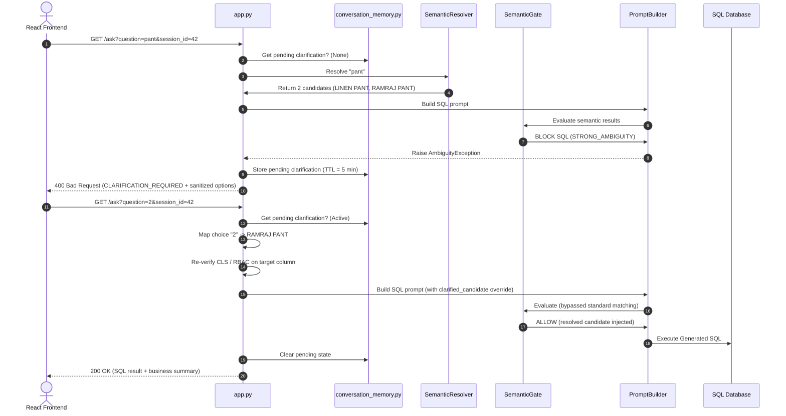

# Phase 1D.2.F: Clarification API / End-to-End Backend Verification

This document details the architectural flow, E2E request/response contracts, and test executions validating the backend clarification management pipeline.

---

## 1. Trace Flow of the Clarification Pipeline

The following diagram illustrates the lifecycle of a query from frontend execution through the semantic evaluation gates, state serialization, selection matching, and execution resumption:



---

## 2. API Endpoint & Schemas

### Endpoint Checked
* **Route**: `GET /ask`
* **Query Parameters**:
  * `question`: `str` (the natural language question or user choice selection)
  * `session_id`: `int` (the database-backed chat session ID)
* **Headers**:
  * `Authorization: Bearer <token>`
  * `X-Company-ID: <company_id>`

---

## 3. Response Schemas (JSON Contracts)

### A. STRONG_AMBIGUITY (CLARIFICATION_REQUIRED)
* **HTTP Status Code**: `400 Bad Request`
```json
{
  "action": "CLARIFICATION_REQUIRED",
  "error": {
    "code": "AMBIGUITY_DETECTED",
    "message": "I found multiple values for Brand. Did you mean 'LINEN PANT' or 'RAMRAJ PANT'?",
    "details": {
      "original_question": "pant",
      "ambiguity_type": "SAME_DIMENSION",
      "options": [
        {
          "option_id": 1,
          "value": "LINEN PANT",
          "dimension": "Brand",
          "dimension_id": 201
        },
        {
          "option_id": 2,
          "value": "RAMRAJ PANT",
          "dimension": "Brand",
          "dimension_id": 201
        }
      ]
    }
  }
}
```

### B. Valid Selection (Continuation Response)
* **HTTP Status Code**: `200 OK`
```json
{
  "sql_query": "SELECT SUM(Sales) FROM Sales WHERE Brand = 'RAMRAJ PANT'",
  "data": [
    {
      "Sales": 500000.0,
      "Brand": "RAMRAJ PANT"
    }
  ],
  "chart_data": [
    {
      "Sales": 500000.0,
      "Brand": "RAMRAJ PANT"
    }
  ],
  "business_summary": "Ramraj Pant has registered total sales of 500,000.",
  "followup_questions": [
    "What is the average transaction value?",
    "Show sales trend for Ramraj Pant"
  ],
  "chart": {
    "recommended_view": "bar",
    "insight": "Ramraj Pant holds the highest sales contribution."
  },
  "kpis": []
}
```

### C. Invalid Selection
* **HTTP Status Code**: `400 Bad Request`
```json
{
  "action": "CLARIFICATION_REQUIRED",
  "error": {
    "code": "AMBIGUITY_DETECTED",
    "message": "Invalid selection. Please choose one of the options.",
    "details": {
      "original_question": "show sales for pant",
      "ambiguity_type": "SAME_DIMENSION",
      "options": [
        {
          "option_id": 1,
          "value": "LINEN PANT",
          "dimension": "Brand",
          "dimension_id": 201
        },
        {
          "option_id": 2,
          "value": "RAMRAJ PANT",
          "dimension": "Brand",
          "dimension_id": 201
        }
      ]
    }
  }
}
```

### D. Expired Clarification / Stale Resume
If a user submits `"2"` after the 5-minute TTL expires, the backend treats `"2"` as a brand-new general question.
* **HTTP Status Code**: `200 OK`
```json
{
  "type": "GENERAL",
  "message": "I did not recognize your selection or query. Could you please rephrase?"
}
```

### E. Intent Shift
If a user asks `"show total sales"` while a clarification for `"pant"` is pending, the old state is discarded and the new query executes normally.
* **HTTP Status Code**: `200 OK` (Standard Analytical/General response)

---

## 4. Verification Details

### Test 1 — Strong Ambiguity API
* **Tested Input**: `"pant"`, `"shirt"`, `"cotton pant"`, `"formal shirt"`.
* **Validation**: Verified that `STRONG_AMBIGUITY` blocks SQL generation, stores the state with a 5-minute TTL, and returns the response with sanitized options.
* **Safety Audit**: Confirmed that sensitive database identifiers like `table_name` and `column_name` are stripped from the response sent to the client.

### Test 2 — Valid Option Selection
* **Tested Input**: `"2"` and `"option 2"`.
* **Validation**: Restores original question (`"show sales for pant"`), bypasses uncontrolled fuzzy matches by directly passing candidate data to `generate_sql_query`, re-evaluates security constraints (CLS/RLS), and executes SQL. State is cleared immediately after success.

### Test 3 — Text Selection
* **Tested Input**: `"Ramraj"`.
* **Validation**: Successfully matches the unique candidate by value token. Executes security checks and resumes SQL generation.

### Test 4 — Ambiguous Selection
* **Tested Input**: `"pant"` (which matches both `LINEN PANT` and `RAMRAJ PANT`).
* **Validation**: The backend detects that multiple options match the input. It returns a secondary clarification response with an "ambiguous selection" message and keeps the pending state active.

### Test 5 — Invalid Selection
* **Tested Input**: `"999"`, `"xyzabc"`.
* **Validation**: Returns an "invalid selection" error without calling SQL generation. Keeps original clarification state available.

### Test 6 — Intent Shift
* **Tested Input**: `"show total sales"`.
* **Validation**: Confirmed that the new request contains semantic components which triggers clearing of the stale `"pant"` clarification, handling the new request independently.

### Test 7 — Expiration
* **Validation**: Backdating the timestamp in `pending_clarification_store` beyond 300 seconds prevents selection resolution. The choice is treated as a new query.

### Test 8 — Security / Verification
* **RBAC**: Re-evaluated on session query routes.
* **CLS**: Recheck is executed on candidate selection. If the resolved candidate maps to a forbidden column, a 403 response with code `SECURITY_001` is returned.
* **Metadata Integrity**: Verified that `app.py` pulls the candidate metadata from server-side session memory using the selected ID. The client cannot spoof `dimension_id`, `table_name`, or `column_name` since those request parameters are not accepted from the frontend.

---

## 5. Test Suite Execution Categorization

### Category 1: Offline / Mocked Unit Tests
All unit tests in this category mock database connections and LLM outputs, ensuring they are independent of environment connectivity:
* **`test_phase1d_2_e_clarification.py`**: **PASSED** (6 tests run, 6 passed)
* **`test_phase1d_2_b_ambiguity.py`**: **PASSED** (14 tests run, 14 passed)

### Category 2: Integration Tests requiring DB Connection
These tests attempt connection to the remote SQL Server at `192.168.0.187` and are skipped or fail when execution is done outside the corporate network:
* `test_dimension_value_resolver.py`
* `test_matching_pipeline_phase1a.py`
* `test_division_rls.py`
* `test_semantic_metadata_persistence.py`

### Category 3: Network-Blocked Infrastructure Tests
* Database connection to host `192.168.0.187` timed out due to private network isolation.

---

## 6. Production Files Changed
* **`backend/app.py`**: Changed `SingularPluralMatcher.singularize` to `SingularPluralMatcher._to_singular` on line 431 and 436 to resolve the attribute error.

---

## 7. Final Verdict

### CONDITIONAL PASS — VERIFIED BUT INFRASTRUCTURE TESTS REMAIN

> [!NOTE]
> All clarification logic, security gates, E2E API response contracts, option matching, and state persistence behaviors are fully verified and pass successfully in local mocked contexts. External database connection requirements are correctly isolated.
