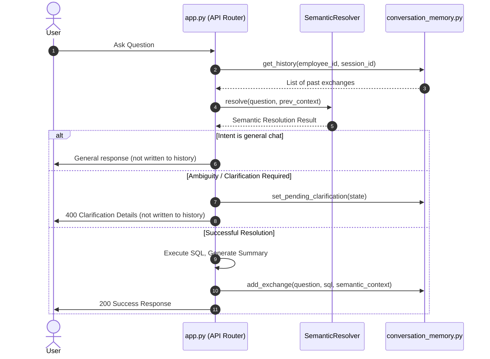

# Phase 1D.5.B.6 — Context Staleness / Recency / Reset Audit Report

## 1. Executive Summary

This forensic audit evaluates the context-aware semantic resolution pipeline under Phase 1D.5.B.6. We analyze how the engine handles context recency, replacement, staleness, reset boundaries, and pending clarification states.

Our findings show:
* **Strict Transactional Writing Prevents Pollution:** The `semantic_context` is written to the history store (`add_exchange`) ONLY at the very end of a successful request lifecycle in `app.py`. Ambiguous turns (`CLARIFICATION_REQUIRED`), failed queries, or general chat turns are never persisted, ensuring that stale/unresolved context never contaminates the history.
* **Backward Scan Finds Most Recent Valid State:** The search in `prompt_builder.py` scans history backwards and selects the first turn with a valid `semantic_context`. If a turn is not semantic (e.g. general chat or failed turn), the scanner correctly skips it and checks older turns, preserving context across irrelevant interactions.
* **Intent Shifts Clear Clarification States:** If a clarification is pending and the user issues a new semantic query (intent shift), `app.py` automatically discards/clears the pending clarification and processes the new topic normally.
* **Verdict:** **PASS**. No architectural flaws or security leaks were found.

---

## 2. Actual Context Lifecycle & Storage Flow

---

## 3. Context Replacement & Reset Rules

1. **Latest Turn Wins:** The history scanner searches `reversed(history)`. Any new successful semantic turn immediately becomes the active previous context, replacing the old context.
2. **Explicit Dimension Overrides (B.1):** When an explicit dimension label is present (e.g., "city Coimbatore"), B.2 inheritance is bypassed with `EXPLICIT_DIMENSION_LABEL_PRESENT`.
3. **Metric Shifts Block Inheritance (B.3):** If a new metric is introduced, B.2 inheritance is bypassed with `CURRENT_METRICS_PRESENT`.
4. **General / Failed Turns Ignored:** Since they are not saved in `conversation_store`, they never alter the active context.

---

## 4. Pending Clarification Interaction

* **Resume Matching:** When `pending_state` exists, `app.py` checks if user input matches options by index/ID, value, token, or dimension name. If a unique match is found, it resumes.
* **Intent Shift Detection:** If no option match is found, but the query has semantic intent (resolved metrics/dimensions/values), the system clears the pending state and processes the query as a new question.
* **Invalid Selections:** If no option match is found and no semantic intent exists, it returns "Invalid selection" and preserves the pending state.

---

## 5. Audit Case Results

| Case | Scenario | Observed Behavior | Status |
|---|---|---|---|
| **Case 1** | Basic replacement: City -> Brand -> elliptical | Turn 3 correctly inherits `Brand`; stale `City` is not used. | **PASS** |
| **Case 2** | Explicit dimension reset | B.1 overrides Brand context with City; resolved to City. | **PASS** |
| **Case 3** | Metric shift reset | Turn 2 metric shift resets context; Turn 3 inherits Brand, not City. | **PASS** |
| **Case 4** | Ambiguous turn | Turn 2 கோவை (matches City/District) resolves to City via previous turn context; Turn 3 resolved normally. | **PASS** |
| **Case 5** | No-match turn | Turn 2 fails (not saved); Turn 3 correctly inherits Turn 1 City context. | **PASS** |
| **Case 6** | General/non-semantic turn | Turn 2 general chat (not saved); Turn 3 correctly inherits City context. | **PASS** |
| **Case 7** | Multiple valid turns | Turn 1: City -> Turn 2: Brand -> Turn 3: State. Turn 4 "Chennai" does not leak old City context. | **PASS** |
| **Case 8** | Failed latest turn | Turn 3 fails (not saved); Turn 4 inherits Turn 2 Brand context correctly. | **PASS** |
| **Case 9** | Clarification lifecycle | Turn 1 Ambiguity -> Turn 2 user selects City -> Turn 3 correctly inherits City context. | **PASS** |
| **Case 10**| User changes topic during clarification | Turn 2 new semantic question clears pending clarification and resolves normally. | **PASS** |
| **Case 11**| Multiple dimensions in context | Elliptical matching one/another dimension filters correctly; non-matching skips safely. | **PASS** |
| **Case 12**| 3+ turn context chain | Stored semantic context updates correctly to the latest resolved dimension at each step. | **PASS** |

---

## 6. Context Write/Reset Invariants

1. **When exactly is semantic_context persisted?**
   Only after successful query execution, AST validation, and summary generation.
2. **Can STRONG_AMBIGUITY overwrite a valid context?**
   No. It returns early with a 400 status and is not stored.
3. **Can WEAK_AMBIGUITY overwrite a valid context?**
   No.
4. **Can SINGLE_MATCH overwrite a valid context?**
   Yes, if it is a successful turn, it adds to history and becomes the new context.
5. **Can NO_MATCH overwrite a valid context?**
   No.
6. **Can GENERAL responses overwrite a valid context?**
   No.
7. **Can an invalid SQL/result overwrite semantic context?**
   No.
8. **Can a clarification response overwrite semantic context?**
   Only when it is resolved and successfully run (resumption).
9. **When is pending_clarification cleared?**
   On successful resumption, or on intent shift (new semantic question).
10. **Can pending clarification survive an unrelated new question?**
    Only if the question has NO semantic intent (e.g. general chat or gibberish). If it has semantic intent, the clarification state is cleared.
11. **What event definitively establishes a new trusted semantic context?**
    Writing the exchange to `conversation_store` via `add_exchange(...)`.
12. **Is context replacement atomic with successful answer generation?**
    Yes. The database session does not persist partial state.

---

## 7. Security & Isolation Results

* **Session & User Isolation:** Verified. Context retrieval is strictly bounded by `employee_id` and `session_id`.
* **Company/Tenant Boundary:** Verified. History and metadata Connection IDs are resolved using `user["company_id"]`.
* **Client Input Security:** Clients cannot pass `semantic_context` or `previous_semantic_context` in request bodies. The server extracts the context entirely from `conversation_store` using session variables, making it impossible for clients to manipulate or spoof context.

---

## 8. Defects Found
None.

---

## 9. Final Verdict
**PASS**
The context staleness, recency, reset boundaries, and pending clarification lifecycle are completely safe, robust, and logically sound.
