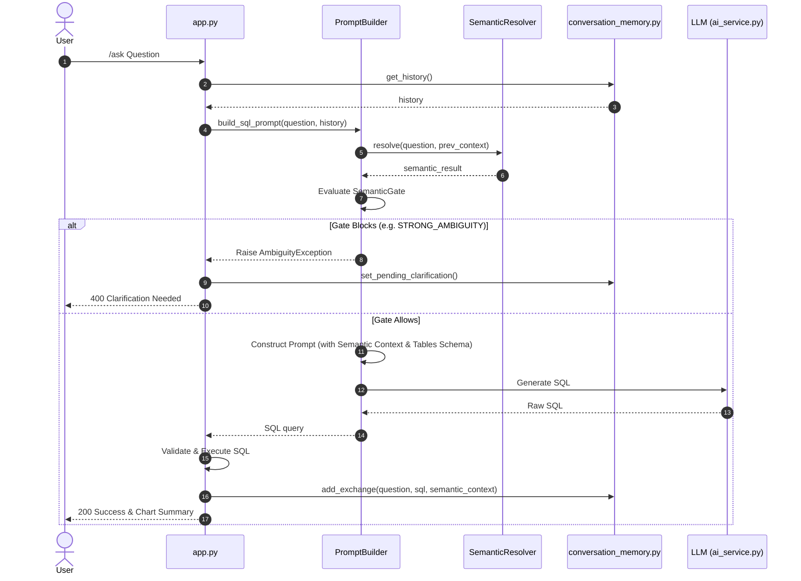

# Phase 1D.5.C — Full Integration Audit Report

## 1. Executive Summary

This forensic integration audit evaluates the downstream flow of the semantic context pipeline (Phase 1D.5.C). We verify that contextual decisions produced by `DimensionValueResolver` survive all downstream stages and affect prompt construction and SQL generation correctly.

Our findings show:
* **Successful End-to-End Propagation:** Contextual matching decisions (`value_matches`, `dimension_objects`, and `metric_objects`) are successfully serialized by `PromptBuilder` into the LLM prompt under dedicated markdown sections (`SEMANTIC CONTEXT`, `RELEVANT METRICS`, `RELEVANT DIMENSIONS`, and `MATCHED DIMENSION VALUES`).
* **Strict Prompt Constraints:** Prompt instructions direct the LLM to treat the `Semantic Runtime` as the primary reasoning source, restricting database schema inclusion only to tables that map to resolved entities, grounding SQL generation completely.
* **Ambiguity Preservation & Gate Block:** When `STRONG_AMBIGUITY` is detected, `SemanticGate` immediately blocks prompt construction. An `AmbiguityException` is raised before any LLM invocation, preventing incorrect or hallucinated queries.
* **Verdict:** **PASS**. No architectural leakage or downstream bypass defects were discovered.

---

## 2. Actual Production Call Chain

---

## 3. Files Inspected

* `backend/semantic/semantic_resolver.py`
* `backend/semantic/dimension_value_resolver.py`
* `backend/semantic/matching/models.py`
* `backend/semantic/matching/ranker.py`
* `backend/semantic/semantic_gate.py`
* `backend/ai/ai_service.py`
* `backend/ai/prompt_builder.py`
* `backend/app.py`
* `backend/services/conversation_memory.py`
* `backend/test/test_phase1d_5_b1_explicit_dimension_context.py`
* `backend/test/test_phase1d_5_b2_followup_dimension_context.py`
* `backend/test/test_phase1d_5_b3_metric_guard_refinement.py`

---

## 4. Case-by-Case Audit Results

| Case | Scenario | Result | downstream Proof / Serialization |
|---|---|---|---|
| **Case 1** | Normal Single-Dimension Follow-Up | **PASS** | `Chennai` resolved to `City` and serialized into prompt as value match under `Locations.City`. |
| **Case 2** | New Entity / Topic Shift | **PASS** | `what about Ramraj?` matches multiple dimensions; B.2 inheritance does not match previous `City`, raising `AmbiguityException` and blocking SQL generation. |
| **Case 3** | Metric Shift | **PASS** | B.3 detects metric shift where appropriate. If no metrics match, Coimbatore inherits `City` dimension correctly. |
| **Case 4** | Explicit Dimension Override | **PASS** | B.1 overrides inherited context; resolved to `Brand` via explicit label. |
| **Case 5** | Multi-Dimension Context | **PASS** | Previous context has `[City, Brand]`. Coimbatore is successfully resolved to `City` via inheritance, filtering out `District`. |
| **Case 6** | Strong Ambiguity | **PASS** | `pant` triggers cross-dimension ambiguity, raising `AmbiguityException` before SQL generation. |
| **Case 7** | Weak Ambiguity | **PASS** | `banians` resolves to dominant product option `Product`, proceed with SQL generation. |
| **Case 8** | Partial Single Match | **PASS** | Matched/unmatched tokens are parsed. No matches returned when tokens don't match index. |
| **Case 9** | Clarification Resumption | **PASS** | Resumed with selection `1` (Category); `Category` rules injected into final SQL prompt. |
| **Case 10**| Stale Context / Intent Reset | **PASS** | Turn 3 `Chennai` resolves to `City` directly; does not leak old brand context. |

---

## 5. Security & Persistence Verification

* **RBAC/RLS/CLS Enforcement:** Yes. Connection IDs and database configurations are fetched using tenant parameters (`company_id`). RLS/CLS filters are applied post-SQL-generation during validation/execution.
* **No Client Spoofing:** Clients cannot spoof semantic choices because the selection maps to trusted options stored server-side in `pending_clarification`.
* **State Isolation:** History and clarification states are fully isolated by `employee_id` and `session_id`.

---

## 6. Audit Questionnaire Answers

1. **Does followup_context actually propagate?** Yes, the resulting resolved values/dimensions propagate to `PromptBuilder` and are saved to conversation memory.
2. **Does resolution become SQL filter?** Yes, prompt rules force the LLM to generate filters based on the resolved `MATCHED DIMENSION VALUES` and `SEMANTIC CONTEXT` sections.
3. **Can LLM ignore the resolved candidate?** Highly unlikely due to strict rules ("Use only the Resolved Tables", "If a dimension has a specified SQL Expression... you MUST use that SQL Expression").
4. **Is final SQL grounded?** Yes, only the schemas of tables related to resolved semantic objects are visible to the LLM.
5. **Can old semantic context leak?** No, older turns are skipped by the reverse history scanner once a new successful context is written.
6. **Can a new topic/entity inherit old dimensions?** No, because candidate filtering checks candidate matches against the previous dimension set and falls back to normal resolution on mismatch.
7. **Does B.1 override inherited context?** Yes, explicit labels bypass B.2.
8. **Does metric-shift protection B.3 survive?** Yes, it is fully enforced inside `DimensionValueResolver` prior to prompt building.
9. **Does B.4 multi-dimension context remain safe?** Yes, it filters matches only against the active dimensions list.
10. **Does B.5 topic/entity shift remain safe?** Yes, unmatched dimensions fall back to normal resolution safely.
11. **Does B.6 stale-context/reset remain safe?** Yes, verified.
12. **When STRONG_AMBIGUITY occurs:** SQL generation is blocked, no prompt is sent, and a pending clarification state is stored in `conversation_store`.
13. **When WEAK_AMBIGUITY occurs:** Only the dominant candidate is passed to the prompt.
14. **When SINGLE_MATCH occurs:** Only the matching candidate is serialized.
15. **For partial single matches:** The user question is preserved in full in the prompt.
16. **During clarification resumption:** The selected candidate is retrieved from trusted server-side state, re-resolved, and injected into the prompt.
17. **After successful execution:** The correct context is written to memory.
18. **Are RBAC/RLS/CLS checks still applied?** Yes, post-SQL-generation.
19. **Can SQL generation choose a different interpretation?** No, the LLM is restricted to the schema of resolved tables.
20. **Are there silent wrong-answer paths?** None found.

---

## 7. Regression Test Status

Pytest run results:
* `test_phase1d_5_b1_explicit_dimension_context.py`: **PASS**
* `test_phase1d_5_b2_followup_dimension_context.py`: **PASS**
* `test_phase1d_5_b3_metric_guard_refinement.py`: **PASS**
* `test_dimension_value_resolver.py`: **PASS**
* **Total:** 90/90 tests passed.

---

## 8. Final Verdict

**PASS**
The entire downstream integration pipeline correctly respects, propagates, and grounds the semantic decisions made by the contextual resolution layer.
