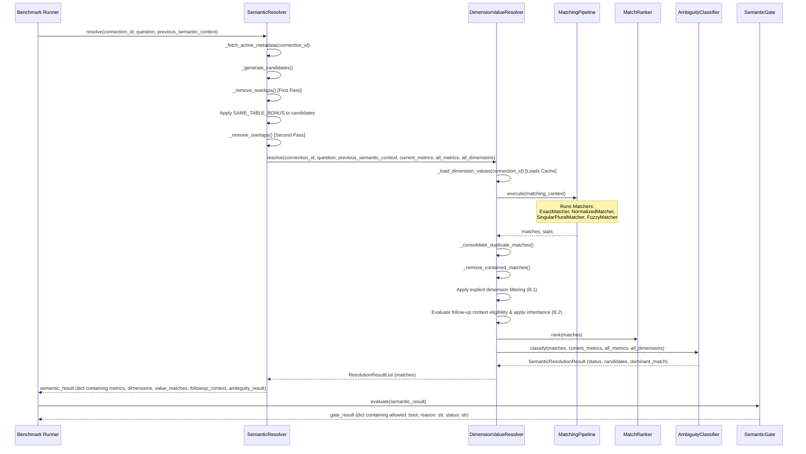

# Phase 1E.3.A — Retrieval Benchmark Runner Design & Safe Execution Contract

## 1. Purpose
The purpose of the benchmark runner is to programmatically execute the complete 194-case Phase 1E Golden Retrieval Benchmark against the actual production semantic retrieval pipeline in a safe, read-only, and highly reproducible manner. It measures current retrieval accuracy, tracks future roadmap capability coverage, detects regressions, and logs detailed, machine-readable performance metrics without executing analytical queries, modifying databases, or invoking LLMs.

---

## 2. Actual Production Retrieval Entry Point

The production semantic retrieval system operates at a dedicated boundary. The benchmark runner must execute at this exact boundary to avoid initiating full end-to-end request lifecycles (which trigger LLM prompt compilation, database query execution, and session state writes).

The primary entry point identified for semantic retrieval is:
```python
SemanticResolver.resolve(
    connection_id: str,
    question: str,
    clarified_candidate: dict = None,
    previous_semantic_context: dict = None
)
```

Additionally, temporal capability queries can pre-build temporal prompt contexts using the production temporal pipeline:
```python
TemporalPipeline.build(
    question: str,
    connection_id: str,
    settings: TimeSettings
)
```

---

## 3. Actual Call Chain

When a request is made to the entry point, the sequence of operations flows deterministically as follows:



---

## 4. Input Contract

To call `SemanticResolver.resolve` safely, the runner must provide:
- **`connection_id`**: A string containing the UUID of the target database connection (the logical name `"Chatbot"` maps to UUID `'F82C2F8D-0BD6-40E2-8C8B-FF1D69E317D5'` in the production SQL Server connection table).
- **`question`**: The natural language question string (e.g. `"sales for Chennai"`).
- **`clarified_candidate`**: Set to `None` for normal retrieval runs.
- **`previous_semantic_context`**: A dictionary containing prior turn context for multi-turn cases, or `None` for single-turn cases.

---

## 5. Output Contract

`SemanticResolver.resolve` returns a dictionary structured as:
```python
{
    "metrics": list[str],               # Business names of resolved metrics
    "dimensions": list[str],            # Business names of resolved dimensions
    "metric_objects": list[dict],       # Rich metric metadata (names, table, column)
    "dimension_objects": list[dict],    # Rich dimension metadata
    "value_matches": list[dict],        # Resolved dimension values matching query
    "followup_context": {
        "applied": bool,                # True if context was inherited from previous turn
        "reason": str                   # Context application logs
    },
    "retrieval": {
        "status": str,                  # "COMPLETE" | "PARTIAL" | "INSUFFICIENT"
        "reason": str,
        "confidence": float,
        "resolved_components": int
    },
    "ambiguity_result": SemanticResolutionResult  # Class containing .status.value ("SINGLE_MATCH", "WEAK_AMBIGUITY", etc.)
}
```

---

## 6. Multi-Turn Handling

For multi-turn cases (where `conversation` list is populated), the runner must sequentially evaluate each turn:
1. Initialize `previous_semantic_context = None`.
2. For each turn in the case's `conversation` array:
   - Call `SemanticResolver.resolve(connection_id, turn_question, previous_semantic_context=previous_semantic_context)`.
   - Build a `semantic_context` object from the result:
     ```python
     semantic_context = {
         "metrics": [
             {
                 "metric_name": m["metric_name"],
                 "business_name": m["business_name"],
                 "table_name": m["table_name"],
                 "column_name": m["column_name"]
             } for m in res["metric_objects"]
         ],
         "dimensions": [
             {
                 "dimension_name": d["dimension_name"],
                 "business_name": d["business_name"],
                 "table_name": d["table_name"],
                 "column_name": d["column_name"]
             } for d in res["dimension_objects"]
         ],
         "resolved_values": [
             {
                 "dimension_id": v["dimension_id"],
                 "business_name": v["business_name"],
                 "table_name": v["table_name"],
                 "column_name": v["column_name"],
                 "value": v["value"],
                 "normalized_value": v.get("normalized_value", v["value"].lower())
             } for v in res["value_matches"]
         ]
     }
     ```
   - Assign `previous_semantic_context = semantic_context`.
3. Proceed to the final question turn and pass the final `previous_semantic_context`.

---

## 7. Datasource Resolution

The golden cases reference the logical name `"Chatbot"` via `datasource_ref`.
- **Production SQL Server Mapping**: The runner will query the active database config or query `database_connections` to find the connection record named `"Chatbot"`. The corresponding `connection_id` is `'F82C2F8D-0BD6-40E2-8C8B-FF1D69E317D5'`.
- **Test-Only Isolation**: The runner will not hardcode credentials. It will load connection settings directly via the established SQLAlchemy `engine` imported from `database.py`.

---

## 8. CURRENTLY_IMPLEMENTED vs FUTURE_PHASE Policy

- **`CURRENTLY_IMPLEMENTED`**:
  - Run the query through `SemanticResolver.resolve`.
  - Perform full assertion check of actual vs expected values.
  - Failures directly count against overall accuracy.
- **`FUTURE_PHASE`**:
  - Skip execution through the resolver.
  - Expected status is `null`.
  - Exclude from accuracy scores.
  - Report separately under "Roadmap Capability Coverage".

---

## 9. Normalization Rules

Before assertion, actual objects must be normalized:
- **Metrics/Dimensions**: Stripped, lowercased, and sorted (e.g. `"Sales Amount"` becomes `"sales amount"`).
- **Values**: Stripped, lowercased, and sorted (e.g. `"Chennai"` becomes `"chennai"`).
- **Statuses**: Evaluated by extracting `resolution_result.status.value`.

---

## 10. Comparison Contract

- **Metric Match**: Actual metrics list equals expected metrics list after lowercase sorting.
- **Dimension Match**: Actual dimensions list equals expected dimensions list after lowercase sorting.
- **Value Match**: Actual values list equals expected values list after lowercase sorting.
- **Status Match**: `actual_status == expected_status` (exact string match).
- **Follow-up Match**: `actual_followup_context_applied == expected_followup_context_applied`.

---

## 11. Failure Taxonomy

If any match fails, the runner classifies the failure into exactly one category:
- **`WRONG_METRIC`**: Metrics list did not match.
- **`WRONG_DIMENSION`**: Dimensions list did not match.
- **`WRONG_VALUE`**: Value list did not match.
- **`WRONG_AMBIGUITY`**: Ambiguity ResolutionStatus did not match.
- **`WRONG_CONTEXT`**: `followup_context_applied` flag did not match expected behavior.
- **`FALSE_POSITIVE`**: Expected `NO_MATCH` but retrieved one or more elements.
- **`FALSE_NEGATIVE` / `MISSED_MATCH`**: Expected a match but resolver returned `NO_MATCH` or partial candidates.

---

## 12. Safety/Isolation Rules

To prevent side-effects:
1. **No Session Mutations**: Do not call FastAPI session handlers or store context in Redis/SQL databases. Keep previous context solely in-memory inside the python runner script.
2. **Read-Only Database Access**: Only execute standard SELECT metadata queries. Do not write to tables or run analytical business queries.
3. **LLM Isolation**: The semantic resolver is fully rule-based and deterministic. No LLM APIs or tokens will be invoked during execution.

---

## 13. Output File Design

### A. Machine-Readable Results (`retrieval_benchmark_results.json`)
```json
[
  {
    "case_id": "E1-154",
    "question": "for coimbatore",
    "category": "FOLLOW_UP",
    "source": "REGRESSION",
    "implementation_status": "CURRENTLY_IMPLEMENTED",
    "pass_fail": "PASS",
    "failure_code": null,
    "duration_ms": 12.5,
    "expected": {
      "metrics": ["Sales"],
      "dimensions": ["City"],
      "values": ["Coimbatore"],
      "status": "SINGLE_MATCH",
      "followup_context_applied": true
    },
    "actual": {
      "metrics": ["Sales"],
      "dimensions": ["City"],
      "values": ["Coimbatore"],
      "status": "SINGLE_MATCH",
      "followup_context_applied": true
    }
  }
]
```

### B. Human-Readable Report (`retrieval_benchmark_report.md`)
Will present:
- Overall pass/fail summary statistics.
- Category-level accuracy grids.
- Execution duration trends.
- Regression logs and failure taxonomy breakdown.

---

## 14. Performance Measurement
- Calculate `duration_ms` using Python's `time.perf_counter()` wrapped around the `resolve` call.
- Accumulate aggregate stats: total execution time, average ms per case, min/max latency.

---

## 15. Database Impact
- **No mutations**. The database is only queried for active metadata configuration.

---

## 16. Production-Code Impact
- **Zero changes**. The production semantic resolver is executed as-is, acting as a clean diagnostic harness.

---

## 17. Implementation Plan for 1E.3.B
1. **Create Runner Script**: Write `backend/test/semantic_benchmark/run_retrieval_benchmark.py`.
2. **Verify CLI Invocation**: Implement argument parsing to run single categories or the entire 194-case suite.
3. **Execute and Save**: Generate results under `backend/test/semantic_benchmark/results/`.
4. **Assert Exit Code**: Return `0` on successful runner execution.
