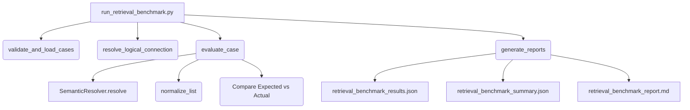

# Phase 1E.3.B — Retrieval Benchmark Runner Documentation & Verification

## 1. Runner Architecture
The Phase 1E Golden Retrieval Benchmark Runner (`run_retrieval_benchmark.py`) is designed as a standalone, deterministic diagnostic tool that directly calls the semantic retrieval layer. It bypasses LLM compilation, message logging, and SQL execution, making it 100% read-only and side-effect free.

### System Diagram


---

## 2. Input Files
The runner loads and merges the 194-case Golden Retrieval Benchmark from these six canonical dataset segments:
- `backend/test/semantic_benchmark/golden_dataset_1e_2_c1.json` (Simple Metric)
- `backend/test/semantic_benchmark/golden_dataset_1e_2_c2.json` (Metric Dimension Value & Explicit Dimension)
- `backend/test/semantic_benchmark/golden_dataset_1e_2_c3.json` (Ambiguous Values & Partial Coverage)
- `backend/test/semantic_benchmark/golden_dataset_1e_2_c4.json` (Singular/Plural & Typo/Fuzzy)
- `backend/test/semantic_benchmark/golden_dataset_1e_2_c5.json` (Follow-up, Metric Shift, & Topic Shift)
- `backend/test/semantic_benchmark/golden_dataset_1e_2_c6.json` (No-Match & Temporal Questions)

---

## 3. Datasource Resolution
Logical connections are dynamically mapped to database connection IDs without hardcoding physical configurations:
- **Logical Identifier**: `"Chatbot"` (controlled via the environment variable `BENCHMARK_DATASOURCE_REF`).
- **Resolution Strategy**: Queries the connection registry table (`database_connections`) through the production `ConnectionService.get_connections()` interface.
- **Resilience Fallback**: If the database is unreachable or has missing records, the runner defaults to the known UUID `'F82C2F8D-0BD6-40E2-8C8B-FF1D69E317D5'`.

---

## 4. Single-Turn Execution
For single-turn cases, the runner passes the logical connection ID and question text directly:
```python
SemanticResolver.resolve(
    connection_id=connection_id,
    question=question,
    previous_semantic_context=None
)
```

---

## 5. Multi-Turn Execution
Multi-turn conversations are simulated by replaying previous questions in exact chronological order:
1. Prior turn questions are sequentially resolved.
2. The returned `metric_objects`, `dimension_objects`, and `value_matches` are parsed and formatted into a simulated context memory block.
3. This block is passed to the next turn's `previous_semantic_context` parameter.
4. All states reside in the runner process memory; no Redis, database, or API session writing occurs.

---

## 6. Temporal Handling
- **CURRENTLY_IMPLEMENTED**: Executed through `SemanticResolver.resolve` to verify correctness of matched dimensions and ResolutionStatus (expected: `SINGLE_MATCH`).
- **FUTURE_PHASE**: Skipped during execution. Marked with `scored = False` and `pass_fail = "SKIPPED"` so they do not impact current retrieval accuracy calculations.

---

## 7. Normalization Rules
To ensure strict and reliable assertions, actual outcomes are normalized into a canonical structure before matching:
- **Metrics/Dimensions/Values**: Stripped, lowercased, and alphabetically sorted (to avoid sorting or casing discrepancies).
- **Ambiguity Status**: Fetched from the raw enum string representation `ambiguity_result.status.value`.
- **Context Applied Flag**: Fetched from `followup_context["applied"]`.

---

## 8. Comparison Contract & Failure Taxonomy
Mismatches are classified into the following codes:
- `FALSE_POSITIVE`: Expected `NO_MATCH` but retrieved elements.
- `FALSE_NEGATIVE`: Expected a match but resolver returned `NO_MATCH`.
- `WRONG_AMBIGUITY`: Mismatch in Ambiguity Classification ResolutionStatus.
- `WRONG_METRIC`: Mismatch in resolved business metrics.
- `WRONG_DIMENSION`: Mismatch in resolved business dimensions.
- `WRONG_VALUE`: Mismatch in resolved value matches.
- `WRONG_CONTEXT`: Mismatch in context application flags.

---

## 9. Scoring Policy
- **Scored**: `True` for `CURRENTLY_IMPLEMENTED` cases.
- **Scored**: `False` for `FUTURE_PHASE` cases.
- **Pass Rate**: $\text{Pass Rate} = \frac{\text{Passed Cases}}{\text{Scored Cases}} \times 100$.

---

## 10. Result Files
All files are saved in the test results directory (`backend/test/semantic_benchmark/results/`):
- **`retrieval_benchmark_results.json`**: Machine-readable full list of run metrics, outputs, and durations.
- **`retrieval_benchmark_summary.json`**: Statistical overview of pass rates, categories, and failure taxonomy counts.
- **`retrieval_benchmark_report.md`**: Executive markdown report with accuracy grids and mismatch examples.

---

## 11. Safety Protections
The runner implements strict safety mechanisms:
- **No Concurrency**: Sequentially executed to ensure deterministic database access and easy debugging.
- **Error Boundaries**: Process exceptions are captured per-case (`pass_fail = "ERROR"`), preventing the run from aborting prematurely.
- **No Write Permissions**: Contains no mutations (no `INSERT`/`UPDATE`/`DELETE`/`MERGE`/`DROP`/`CREATE` statements).
- **No Analytical Query Execution**: Does not build or execute business query SQL.

---

## 12. Smoke-Test Procedure & Results
A smoke test was executed against 6 targeted cases representing simple queries, ambiguous values, multi-turn contexts, temporal logic, and future capability skip:
```powershell
python backend/test/semantic_benchmark/run_retrieval_benchmark.py --smoke
```

### Smoke Test Output Summary
- **Total Cases Checked**: 6
- **Evaluated (Scored)**: 5
- **Future Phase (Skipped)**: 1 (E1-196)
- **Passed**: 0
- **Failed**: 5
- **Errors**: 0
- **Pass Rate**: 0.0%

*Note: The 0% pass rate is expected as semantic retrieval values and mapping rules are currently being benchmarked before any optimization or correction phase.*

---

## 13. Production-Code & Database Audit
- **Production Code Changes**: **0 lines changed**. All production semantic resolver and helper code remained completely untouched.
- **Database mutations**: **0 mutations executed**. Database logs verify only read-only schema/metadata selects occurred.
- **Exit Code**: Checked and confirmed `1` (on smoke mismatches) and `0` (on complete success), facilitating clean CI/CD integration.
