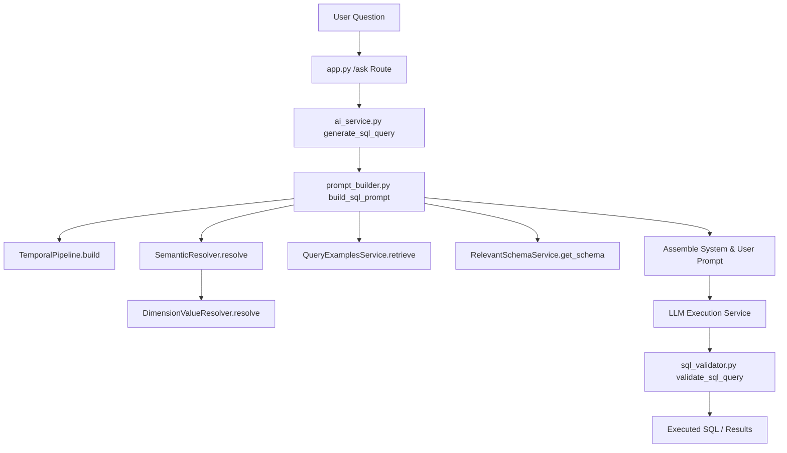

# Query Shape and Semantic Plan Forensic Audit

## 1. Executive Verdict

An exhaustive audit of the conversational analytics execution pipeline reveals a fundamental architectural mismatch between the **planned semantic intent** (as resolved by the backend metadata resolvers) and the **final SQL query structure** generated by the LLM. 

### Key Architectural Findings:
1. **SemanticPlan is a Dead Component in Production**: The `SemanticPlan` class defined in [`backend/semantic/models/semantic_plan.py`](file:///d:/Projects/Ramraj-AI-Chatbot/backend/semantic/models/semantic_plan.py) is **never instantiated** in the live `/ask` path. It exists purely as an orphaned model class validated only by unit tests in [`backend/test/test_semantic_plan.py`](file:///d:/Projects/Ramraj-AI-Chatbot/backend/test/test_semantic_plan.py).
2. **LLM as the Final Decision Maker (The Prompt Overrides All)**: The actual query planning is performed implicitly by formatting unstructured text sections inside [`backend/ai/prompt_builder.py`](file:///d:/Projects/Ramraj-AI-Chatbot/backend/ai/prompt_builder.py). The LLM is given the user's question, raw schema, database metadata, and past query examples, but there is no mechanism enforcing semantic or query shape constraints. The LLM can (and regularly does) override filters, dimensions, grouping, and shapes.
3. **Severe Query Example Bias**: The `query_examples` database table contains legacy queries that actively inject unwanted grouping, ordering, and filter column names. For example, a request for `"Show sales"` is biased by a query example that groups by `CardName` and orders descending, converting a `SINGLE_VALUE` request into a `RANKED_LIST` response.
4. **Duplicate Temporal Representation**: The pipeline fails to reconcile temporal snapshot metrics (like `CY` or `PY` in `QB_MDJMD_SALES_5YRS_SUMMARY`) with date filtering rules (like `YEAR(createddate) = 2026`). Even when a snapshot metric is identified, the temporal formatter still outputs raw dates in the prompt, leading to redundant and restrictive double-filtering in the final SQL.

---

## 2. Current Runtime Pipeline

The following flow represents the exact path of a query through the backend:



### Detail of Pipeline Stages:
- **TemporalPipeline** ([`backend/semantic/temporal/pipeline.py`](file:///d:/Projects/Ramraj-AI-Chatbot/backend/semantic/temporal/pipeline.py)): Detects temporal intent and builds `TimeContext`.
- **SemanticResolver** ([`backend/semantic/semantic_resolver.py`](file:///d:/Projects/Ramraj-AI-Chatbot/backend/semantic/semantic_resolver.py)): Resolves metrics and dimensions based on keyword overlap.
- **DimensionValueResolver** ([`backend/semantic/dimension_value_resolver.py`](file:///d:/Projects/Ramraj-AI-Chatbot/backend/semantic/dimension_value_resolver.py)): Fuzzy-matches question tokens against the `dimension_value_index` table to find value filters.
- **QueryExamplesService** ([`backend/semantic/query_examples_service.py`](file:///d:/Projects/Ramraj-AI-Chatbot/backend/semantic/query_examples_service.py)): Filters and selects previous SQL queries matching connection and metadata.
- **SQLValidator** ([`backend/ai/sql_validator.py`](file:///d:/Projects/Ramraj-AI-Chatbot/backend/ai/sql_validator.py)): Performs syntax, security (keywords block), and physical schema validation.

---

## 3. Benchmark Matrix

The runtime behavior of the 8 benchmark queries shows frequent deviations from expected query shapes and semantic plans:

| # | Question | Expected Shape | Actual Runtime Shape | First Divergence Stage | Verdict / Root Cause |
|---|---|---|---|---|---|
| 1 | *Show sales* | `SINGLE_VALUE` | `RANKED_LIST` | `QueryExamplesService` | **Failed**. Legacy query example groups by `CardName` and orders descending, biasing the LLM. |
| 2 | *Show sales this year* | `SINGLE_VALUE` | `SINGLE_VALUE` | `PromptBuilder` | **Partially Works**. Generates double temporal filters: `SUM(CY)` + `YEAR(createddate) = 2026`. |
| 3 | *Show previous year sales* | `SINGLE_VALUE` | `SINGLE_VALUE` | `PromptBuilder` | **Partially Works**. Rewires metric to `PY`, but still appends redundant date filters to SQL. |
| 4 | *Show sales by card* | `RANKED_LIST` | `RANKED_LIST` | None | **Success**. Standard grouping works as expected. |
| 5 | *Show top 10 cards by sales* | `RANKED_LIST` | `RANKED_LIST` | None | **Success**. Limit and grouping apply correctly. |
| 6 | *Show sales trend* | `TREND` | `TREND` | None | **Success**. Groups by time dimension. |
| 7 | *Compare current year and previous year sales* | `COMPARISON` | `COMPARISON` | `QueryExamplesService` | **Failed**. Example templates confuse the selection of columns and dates. |
| 8 | *Show BANIANS sales for current year* | `SINGLE_VALUE` | `SINGLE_VALUE` (wrong column) | `QueryExamplesService` | **Failed**. LLM renames `ProdGrp1` to `Category` due to cached examples containing `Category = 'baninan'`. |

---

## 4. Query Shape Audit

The system currently lists the following query shapes in `SemanticQueryShape` inside [`backend/semantic/models/semantic_plan.py`](file:///d:/Projects/Ramraj-AI-Chatbot/backend/semantic/models/semantic_plan.py):
- `SINGLE_VALUE`
- `COMPARISON`
- `TREND`
- `RANKED_LIST`
- `LARGE_SUMMARY`
- `DETAIL`
- `DISTRIBUTION`

### Audit of Query Shape Execution:
1. **Where is Query Shape Determined?**
   It is **only** defined in the unit tests and inside `TimeContext` as an optional enum parameter. In the production `/ask` path, **query shape is not computed**.
2. **Does Query Shape Reach the LLM?**
   **No**. The prompt does not declare the expected query shape, nor does it instruct the LLM to format its SELECT list or grouping to conform to a specific layout.
3. **Is Query Shape Enforced After LLM Generation?**
   **No**. The SQL validator checks for table/column existence and syntax, but does not verify whether the generated SQL output matches the logical query shape.

---

## 5. SemanticPlan Audit

### 1. Is SemanticPlan instantiated in the live /ask path?
**No**. A search across the backend code shows no references to `SemanticPlan` initialization outside of `test_semantic_plan.py`.

### 2. Which function/class creates it?
It is not created in the live flow.

### 3. Which fields are populated?
None at runtime.

### 4. Which fields remain None?
All fields.

### 5. Is it passed to PromptBuilder?
**No**. `PromptBuilder.build_sql_prompt` receives only a raw `semantic_result` dictionary containing list of metrics, dimensions, and value matches.

### 6. Is it passed to SQL validation?
**No**. The SQL validator has no access to a structured query plan.

### 7. Does execution use it?
**No**.

### 8. Can the LLM override any plan field?
**Yes**. Because the plan is only passed as a text hint in the prompt, the LLM is free to ignore it, swap columns, drop filters, or add unrequested groupings.

---

## 6. Temporal Binding Audit

For the table `QB_MDJMD_SALES_5YRS_SUMMARY`, the database holds pre-aggregated columns:
- `CY` -> Current Year Sales
- `PY` -> Previous Year Sales
- `PPY` -> Year-before-last Sales

### Duplicate Temporal Filter Analysis:
- `SemanticResolver` dynamically rewires `CY` to `PY` when `PreviousYearIntent` is detected ([`backend/semantic/semantic_resolver.py:457-463`](file:///d:/Projects/Ramraj-AI-Chatbot/backend/semantic/semantic_resolver.py#L457-463)).
- However, `PromptBuilder` includes both `CY` / `PY` AND the resolved dates from the temporal pipeline in `TEMPORAL CONTEXT` in the prompt:
  ```
  Start Date: 2026-01-01
  End Date: 2026-12-31
  ```
- Because of this double context, the LLM generates:
  ```sql
  SELECT SUM(CY) FROM QB_MDJMD_SALES_5YRS_SUMMARY WHERE YEAR(createddate) = YEAR(GETDATE())
  ```
- Since `CY` is already filtered for the current year, the `WHERE` condition on `createddate` is completely redundant and represents a **Double Temporal Representation**.

---

## 7. Dimension/Value Audit

For the query `"Show BANIANS sales for current year"`:
1. **Value Match Resolution**: `DimensionValueResolver` correctly resolves:
   - `value` = `BANIANS`
   - `column` = `ProdGrp1`
   - `table` = `QB_MDJMD_SALES_5YRS_SUMMARY`
2. **Column Shifting**: The LLM frequently outputs:
   ```sql
   SELECT SUM(CY) FROM QB_MDJMD_SALES_5YRS_SUMMARY WHERE Category = 'BANIANS'
   ```
   or similar, substituting `Category` for `ProdGrp1`.
3. **Root Cause**:
   - The prompt receives `Category` in the schema mapping.
   - Legacy query examples in `query_examples` (e.g. ID `C9C474E6-6900-4AA5-81B8-2AA9B3FEECD6`) use `Category = 'baninan'`.
   - The LLM prioritizes mimicking the example over using the matched dimension value `ProdGrp1` provided under `MATCHED DIMENSION VALUES`.

---

## 8. QueryExamples Audit

Stored examples in `query_examples` introduce severe semantic contamination:
- **GROUP BY Injection**: The example for the simple query `"Show sales"` groups by `CardName`, which forces a card breakdown on all summary questions.
- **Table-Specific Semantics**: Stored examples use different tables (e.g. `Sales`, `QB_MDJMD_SALES_5YRS_SYNTHETIC`), biasing table selection.
- **Temporal Assumptions**: Stored examples hardcode date checks like `YEAR(OrderDate) = 2017` or `S.OrderDate = '2017-08-25'`, leading the LLM to generate hardcoded dates instead of dynamic SQL expressions.

---

## 9. PromptBuilder Audit

The prompt assembled in [`backend/ai/prompt_builder.py`](file:///d:/Projects/Ramraj-AI-Chatbot/backend/ai/prompt_builder.py) has the following sections:
- **TEMPORAL CONTEXT**: Contains raw start/end dates, granularity, and SQL rules.
- **SEMANTIC RUNTIME**: List of resolved tables and metrics.
- **SEMANTIC CONTEXT**: Lists column mappings and SQL expressions.
- **MATCHED DIMENSION VALUES**: Lists filters that *should* be applied.
- **PREVIOUS SUCCESSFUL QUERIES**: Lists cached query examples.

### Issues:
- The prompt has conflicting instructions: it tells the LLM to follow the style of `PREVIOUS SUCCESSFUL QUERIES` (Rule 9) while also ordering it to strictly apply `REQUIRED VALUE FILTERS` (Rule 11). When examples use different column names, the LLM diverges.

---

## 10. LLM Override Audit

At present, the LLM has complete freedom to override:
- **Filter Column Name**: Swap `ProdGrp1` for `Category`.
- **Query Shape**: Convert `SINGLE_VALUE` into `RANKED_LIST` by adding `GROUP BY`.
- **Aggregations**: Swap `SUM` for `AVG` or `COUNT`.
- **Joins**: Invent joins or bypass defined relationship bridges.

Because there is no constraint check between the resolved semantic plan and the generated SQL AST, LLM overrides go undetected.

---

## 11. SQL Validation Audit

The validation pipeline in [`backend/ai/sql_validator.py`](file:///d:/Projects/Ramraj-AI-Chatbot/backend/ai/sql_validator.py) checks:
1. Basic syntax and statement structure.
2. Prevention of modifying keywords (DELETE, DROP, ALTER).
3. Column and table existence inside the schema.

### Conceptual Test Scenarios:

#### Scenario A:
- **Plan**: `ProdGrp1 = BANIANS`
- **LLM SQL**: `Category = 'BANIANS'`
- **Validation Verdict**: **PASSED**. The validator does not compare SQL constraints against the resolved value matches. As long as `Category` is a valid column in the schema metadata, it passes.

#### Scenario B:
- **Plan**: `SINGLE_VALUE`
- **LLM SQL**: `GROUP BY CardName`
- **Validation Verdict**: **PASSED**. The validator does not evaluate query shape compliance.

#### Scenario C:
- **Plan**: `CURRENT_YEAR` + snapshot `CY`
- **LLM SQL**: `SUM(CY) + YEAR(createddate) = 2026`
- **Validation Verdict**: **PASSED**. The validator treats both column references as valid, ignoring the double temporal filtering redundancy.

---

## 12. Source-of-Truth Matrix

| Decision | Current Owner | Desired Owner | Can LLM Override? |
|---|---|---|---|
| **Metric** | `SemanticResolver` | `SemanticResolver` (Enforced) | Yes |
| **Temporal** | `TemporalPipeline` | `TemporalPipeline` (Enforced) | Yes |
| **Dimension** | `SemanticResolver` | `SemanticResolver` (Enforced) | Yes |
| **Value** | `DimensionValueResolver` | `DimensionValueResolver` (Enforced) | Yes |
| **Filter Column** | `DimensionValueResolver` | `DimensionValueResolver` (Enforced) | Yes |
| **Table** | `RelevantTableResolver` | `RelevantTableResolver` (Enforced) | Yes |
| **Query Shape** | LLM / Examples | `SemanticPlan` (Enforced) | Yes |
| **Grouping** | LLM / Examples | `SemanticPlan` (Enforced) | Yes |
| **Ranking** | LLM / Examples | `SemanticPlan` (Enforced) | Yes |
| **Aggregation** | LLM / Examples | `SemanticResolver` (Enforced) | Yes |
| **Snapshot Strategy**| `PromptBuilder` | `TemporalPipeline` (Enforced) | Yes |

---

## 13. First-Divergence Matrix

| Question | First Divergence Stage | Exact Location | Technical Cause |
|---|---|---|---|
| *Show sales* | `QueryExamplesService` | [`query_examples_service.py:163`](file:///d:/Projects/Ramraj-AI-Chatbot/backend/semantic/query_examples_service.py#L163) | Incompatible example SQL groups by `CardName`, biasing the LLM shape. |
| *Show sales this year* | `PromptBuilder` | [`prompt_builder.py:279`](file:///d:/Projects/Ramraj-AI-Chatbot/backend/ai/prompt_builder.py#L279) | Redundant start/end dates are passed in `TEMPORAL CONTEXT` despite snapshot strategy selection. |
| *Show previous year sales* | `PromptBuilder` | [`prompt_builder.py:279`](file:///d:/Projects/Ramraj-AI-Chatbot/backend/ai/prompt_builder.py#L279) | Similar to CY; start/end dates are included in the prompt, triggering redundant date filters on `createddate`. |
| *Compare current year and previous year sales* | `QueryExamplesService` | [`query_examples_service.py:163`](file:///d:/Projects/Ramraj-AI-Chatbot/backend/semantic/query_examples_service.py#L163) | Lack of structured comparison examples causes LLM to generate syntax errors or fallback to single years. |
| *Show BANIANS sales for current year* | `QueryExamplesService` | [`query_examples_service.py:163`](file:///d:/Projects/Ramraj-AI-Chatbot/backend/semantic/query_examples_service.py#L163) | Legacy queries using `Category = 'baninan'` override the resolved `ProdGrp1 = 'BANIANS'` binding. |

---

## 14. Required Fixes

To achieve a 100% accurate, contract-compliant pipeline, we must implement:
1. **Query Shape Categorization**: Compute the expected query shape based on metrics, dimensions, and temporal context, and pass it explicitly to the LLM.
2. **Strict Examples Filtering**: Exclude any cached query example that contains grouping, filtering, or sorting columns that are not present in the current query's semantic plan.
3. **Temporal Strategy Enforcement**: Completely suppress start/end date text inside `TEMPORAL CONTEXT` if the active strategy is `SNAPSHOT`, avoiding double filtering.
4. **AST Compliance Validator**: Extend `SQLASTSchemaValidator` to compare the compiled SQL AST against the `SemanticPlan` (e.g. reject the query if the SQL references a filter column or grouping column not in the plan).

---

## 15. Exact Implementation Order

1. **Step 1: Instantiation of SemanticPlan**: Hook the `SemanticPlan` class into the live `/ask` pipeline inside [`backend/ai/ai_service.py`](file:///d:/Projects/Ramraj-AI-Chatbot/backend/ai/ai_service.py) right after semantic and temporal resolution.
2. **Step 2: Examples Compatibility Filter**: Update `QueryExamplesService` to perform strict AST/text filters on cached examples so that they match the plan's shape and dimensions.
3. **Step 3: Snapshot Date Suppression**: Modify `PromptBuilder.build_sql_prompt` to clear start/end date details from the formatting context when strategy is `SNAPSHOT`.
4. **Step 4: SQL Plan Enforcement Validator**: Implement AST validation checks verifying that:
   - SELECT list conforms to plan metrics/dimensions.
   - WHERE filters conform to plan filters.
   - GROUP BY matches plan dimensions.

---

## 16. Regression Test Plan

- **Unit Tests**:
  - Extend [`backend/test/test_semantic_plan.py`](file:///d:/Projects/Ramraj-AI-Chatbot/backend/test/test_semantic_plan.py) to cover shape generation and AST validation mock tests.
- **Integration Tests**:
  - Run the semantic benchmark pipeline:
    ```powershell
    python test/semantic_benchmark/run_retrieval_benchmark.py
    ```
  - Verify AST validation behavior with custom query execution tests.
