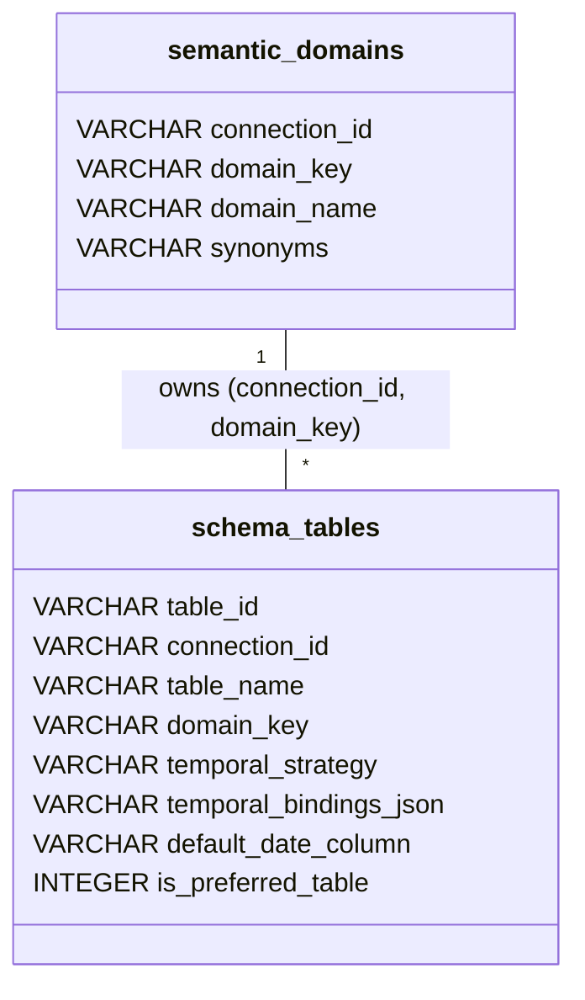
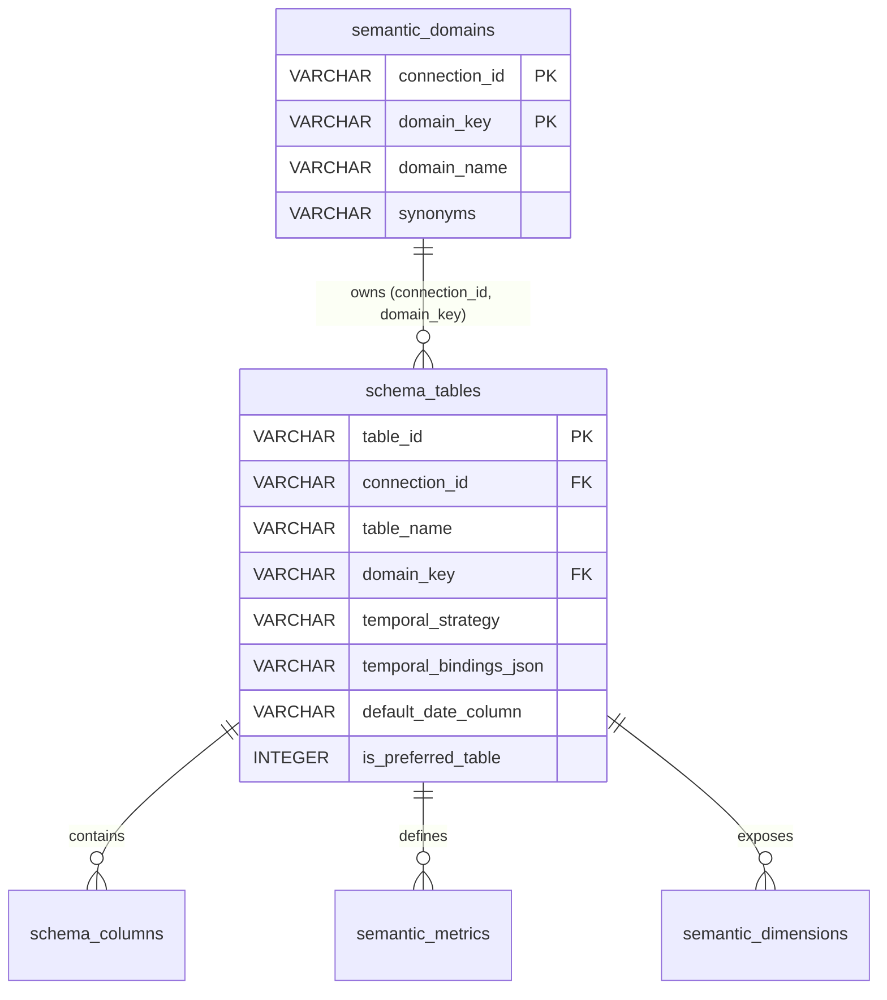

# Semantic Control Center - Phase 1 Foundation Audit & Finalized Design

This document evaluates the current runtime implementation of Query Shape, SemanticPlan, and Temporal Resolution, outlining the finalized architectural design for the Phase 1 Semantic Control Center.

---

## 1. Executive Verdict

- **Existing Structure Capabilities**: The existing schema (`semantic_metrics`, `semantic_dimensions`, `schema_tables`, `schema_columns`) is well-designed, connection-scoped, and covers raw metadata.
- **Architectural Gaps**: Mappings of canonical metrics to period-specific column bindings, table ownership of business domains, and temporal strategies are currently hardcoded in backend services (`semantic_plan_builder.py`, `patterns.py`, `resolver.py`) or connection capability caches.
- **Verdict**: Phase 1 introduces exactly one new metadata table: `semantic_domains`. No other new semantic tables are required. We will slightly extend `schema_tables` to hold domain ownership, temporal strategy, and period bindings metadata, and refactor runtime components to consume these database values authoritatively.

---

## 2. Existing Metadata Inventory

| Source | Scope | Semantic Information Stored | Status |
|---|---|---|---|
| `schema_tables` | Company/Connection | Schema name, table name, table type, sync timestamp. | Discovered dynamically. |
| `schema_columns` | Company/Connection | Column name, data type, numeric properties, nullability. | Discovered dynamically. |
| `semantic_metrics` | Connection | Metric name, business name, table name, column name, aggregation type. | Authoritative. |
| `semantic_dimensions` | Connection | Dimension name, business name, table name, column name, category, synonyms, active status. | Authoritative. |
| `column_display_config` | Connection | Visibility, display label, column type (dimension/metric), display table/column. | Auxiliary (UI/Grid only). |
| `TimeResolutionCache` | Connection (In-Memory) | Date columns, default date column, snapshot columns/mappings. | Ephemeral cache. |

---

## 3. Existing Runtime Consumers

1. **`SemanticResolver`**: Loads metrics and dimensions from `semantic_metrics` and `semantic_dimensions` to perform name/synonym match and value indexing.
2. **`DimensionValueResolver`**: Queries `dimension_value_index` to perform fuzzy matches on dimension values.
3. **`TimeResolver` / `TemporalPipeline`**: Inspects connection capabilities from cache to score strategies and select strategy type.
4. **`SemanticPlanBuilder`**: Compiles metrics, dimensions, values, and time context into `SemanticPlan`. Employs hardcoded bindings configuration to resolve CY/PY columns.
5. **`PromptBuilder`**: Consumes compiled plans to format prompt sections for the LLM.

---

## 4. Current Source-of-Truth Conflicts

1. **Domain/Table Ownership**: Currently, no database column links a query's target domain (e.g. `Order Pending`) to a primary table (e.g. `PBI_ENES_ORDER_PENDING_SUMMARY`). The resolver relies on metric matching, causing queries like `"Show order pendings"` to resolve to `Sales` if no domain pre-classification is defined.
2. **Decoupled Snapshot Mappings**: Mappings of snapshot offsets (e.g. `2 Years Ago` → `PPY`) are stored in memory (`TimeCapability`) but also hardcoded in `semantic_plan_builder.py` and `patterns.py` (via custom intent types).
3. **Analytical vs. Temporal Date Fields**: Date columns (like `createddate`) are mixed in `semantic_dimensions` as analytical columns, causing them to leak into queries as group-by/filters when they should only be used by temporal strategies.

---

## 5. Minimal Phase-1 Semantic Model

We can represent the entire metadata requirements by introducing exactly one new metadata table: `semantic_domains`, and extending `schema_tables` with foreign key mapping:



---

## 6. Domain/Table Ownership Model

To prevent `"Show order pendings"` from entering the `Sales` domain:
- Assign `domain_name = 'Order Pending'` to `PBI_ENES_ORDER_PENDING_SUMMARY` in `schema_tables` via mapping to `semantic_domains`.
- Assign `domain_name = 'Sales'` to `QB_MDJMD_SALES_5YRS_SUMMARY` in `schema_tables` via mapping to `semantic_domains`.
- **Pre-Classification Step**: In `SemanticResolver`, check the query string for domain synonyms/names *before* performing value matches. If a domain name (e.g., "order pending") matches, bind the query's primary table context to the corresponding table immediately.

---

## 7. Metric Model

- **Canonical Metric Name**: Stores the business name in `semantic_metrics` (e.g. `"Sales"`).
- **Physical Column**: If the target table's strategy is `SNAPSHOT`, the physical column is left as `None` or a default, and the system looks up the bindings in `schema_tables.temporal_bindings_json` (e.g., `{"CURRENT_YEAR": "CY", "PREVIOUS_YEAR": "PY", "PPY": "PPY"}`).

---

## 8. Dimension Model

- **Analytical Dimension**: Managed inside `semantic_dimensions` with business synonyms (e.g. `"Group Party" -> GCardName`).
- **Temporal/Internal Date Field**: Configured in `schema_tables.default_date_column`. It is NOT created as an active row in `semantic_dimensions` to prevent date-field leakage.

---

## 9. Temporal Strategy Model

- **Strategy Configuration**: Configured on table level in `schema_tables.temporal_strategy` (values: `SNAPSHOT` or `DATE_COLUMN`).
- **Bindings Configuration**: Configured in `schema_tables.temporal_bindings_json`.
- **Date Column**: Configured in `schema_tables.default_date_column`. No implicit default columns.

---

## 10. What Can Be Reused

- `semantic_metrics` and `semantic_dimensions` database schemas.
- `column_display_config` display labeling system.
- `TimeResolutionCache` connection capability cache representation.

---

## 11. What Must Change

- Replace the hardcoded `SNAPSHOT_SALES_BINDINGS` configuration in `semantic_plan_builder.py` with database queries loading `temporal_bindings_json` from the target table.
- Modify `TimeResolver` and `StrategyCandidateGenerator` to score strategies based on the resolved table's `temporal_strategy` column.
- Update the temporal clarification generator to use `temporal_bindings_json` keys as options.

---

## 12. Minimal Database Changes

Execute a migration on the database connection to add:
```sql
CREATE TABLE semantic_domains (
    connection_id VARCHAR(50) NOT NULL,
    domain_key VARCHAR(50) NOT NULL,
    domain_name VARCHAR(100) NOT NULL,
    synonyms VARCHAR(500) NULL,
    PRIMARY KEY (connection_id, domain_key)
);

ALTER TABLE schema_tables ADD domain_key VARCHAR(50) NULL;
ALTER TABLE schema_tables ADD temporal_strategy VARCHAR(50) NULL;
ALTER TABLE schema_tables ADD temporal_bindings_json VARCHAR(1000) NULL;
ALTER TABLE schema_tables ADD default_date_column VARCHAR(100) NULL;
ALTER TABLE schema_tables ADD is_preferred_table INT DEFAULT 0;

ALTER TABLE schema_tables ADD CONSTRAINT fk_schema_tables_domain 
    FOREIGN KEY (connection_id, domain_key) 
    REFERENCES semantic_domains(connection_id, domain_key);
```

---

## 13. Runtime Integration Points

```
User Query
 → SemanticResolver (Resolves domain_name & tables using semantic_domains)
 → TimeResolver (Loads temporal_strategy & default_date_column from schema_tables)
 → SemanticPlanBuilder (Binds sales metric to column using temporal_bindings_json)
 → PromptBuilder (Generates SQL prompt)
```

---

## 14. Phase-1 Admin UI Structure

```
+-----------------------------------------------------------+
|               SEMANTIC CONTROL CENTER                     |
+-----------------------------------------------------------+
| [1. Domains & Tables] [2. Metrics Manager] [3. Dimensions] |
+-----------------------------------------------------------+
| Table: QB_MDJMD_SALES_5YRS_SUMMARY                        |
| Domain: Sales                                             |
| Temporal Strategy: [ SNAPSHOT | DATE_COLUMN ]             |
| Default Date Column: [ createddate ]                      |
| Snapshot Bindings:                                        |
|   - CURRENT_YEAR  -> [ CY    ]                            |
|   - PREVIOUS_YEAR -> [ PY    ]                            |
|   - 2 YEARS AGO   -> [ PPY   ]                            |
+-----------------------------------------------------------+
```

---

## 15. Explicit Non-Goals

- Editing physical table/column definitions in the source database.
- Relationship schema configuration from the UI.
- Complex multi-metric cross-table joining rules.

---

## 16. Implementation Order

1. **Database Migration**: Add `semantic_domains` table and columns to `schema_tables`.
2. **Metadata Seeding**: Seed existing snapshot bindings and domain associations.
3. **Backend Service Refactoring**: Query the new metadata in `TimeResolver` and `SemanticPlanBuilder`.
4. **UI View Integration**: Add frontend routes and forms for the control center configuration.

---

## 17. Revised Phase 1 Architecture

The finalized Phase 1 Semantic Control Center architecture is designed to fulfill the following goals:
- **Authoritative Database Configurations**: Unifies ephemeral caches and hardcoded configurations into persistent, versionable database schemas.
- **Scoping Mechanics**: Restricts all domain, table, metric, and dimension definitions to the user's connection/company context, ensuring security isolation.
- **Extensible & Decoupled Design**: Separates the business meaning (canonical definitions) from the physical database structure, permitting flexible mapping switches.

---

## 18. Corrected Data Model

To support domain synonyms (Correction 2) and many-to-one domain-to-table ownership (Correction 3), Phase 1 introduces exactly one new metadata table: `semantic_domains`. No other new semantic tables are required.



---

## 19. Domain/Table Ownership

- **Synonym Representation**: `semantic_domains` contains:
  - `connection_id`: Active connection context.
  - `domain_key`: Unique identifier (e.g. `ORDER_PENDING`).
  - `domain_name`: Label (e.g. `Order Pending`).
  - `synonyms`: Commas-separated synonyms list (e.g. `order pending, order pendings, pending orders`).
- **Many-to-One Layout**:
  - Multiple rows in `schema_tables` can point to the same `(connection_id, domain_key)` composite mapping (Correction 3).
  - An integer flag `is_preferred_table` defines the primary default table for queries directed at that domain.

---

## 20. Metric Model

- **Decoupled Definition**: `semantic_metrics` records:
  - `business_name` = `"Sales"`
  - `column_name` = `"None"` (for snapshot strategies)
- **Snapshot Resolution**: At runtime, when resolving `"Sales"` under the `SNAPSHOT` strategy for table `QB_MDJMD_SALES_5YRS_SUMMARY`, the runtime queries `schema_tables.temporal_bindings_json` to fetch the offset mappings dynamically.

---

## 21. Dimension Role Model

We will use the existing `semantic_category` column in `semantic_dimensions` to explicitly segregate dimension roles:
- **`ANALYTICAL`**: Normal slice-and-dice dimensions (e.g. `ProdGrp1`, `CardName`).
- **`ANALYTICAL_TIME`**: Calendar dimensions (e.g. `InvMonth`, `Docdate Year`).
- **`TEMPORAL_INTERNAL`**: Date columns used exclusively for strategy criteria (e.g. `createddate`), which are omitted from analytical selectors to prevent query leaking (Correction 4).

---

## 22. Temporal Model

- **`SNAPSHOT` Strategy**:
  - `default_date_column` is configured as `NULL` (Correction 1).
  - Mappings are fetched from `temporal_bindings_json`:
    ```json
    {
      "CURRENT_YEAR": "CY",
      "PREVIOUS_YEAR": "PY",
      "PPY": "PPY",
      "PPPY": "PPPY",
      "PPPPY": "PPPPY"
    }
    ```
- **`DATE_COLUMN` Strategy**:
  - `default_date_column` must be explicitly configured to the actual date column (e.g. `"createddate"`). No global fallbacks.

---

## 23. Validation Rules

The API endpoints managing configurations will enforce:
1. **Exist Check**: The table name in `schema_tables` must exist in schema metadata.
2. **Column Exist**: Every target column in `temporal_bindings_json` must exist in `schema_columns`.
3. **Date Column Criteria**: If strategy is `DATE_COLUMN`, `default_date_column` cannot be `NULL` and must exist in `schema_columns`.
4. **Snapshot Criteria**: If strategy is `SNAPSHOT`, `default_date_column` must be `NULL` and `temporal_bindings_json` must not be empty.
5. **Security Scope**: `connection_id` must match the user's active session.
6. **Preferred Table Rule**: Only one `schema_tables` row may have `is_preferred_table = 1` for a given `(connection_id, domain_key)`.
7. **Dimension columns**: Dimension physical columns must exist in `schema_columns`.
8. **Metric columns**: Metric physical columns must exist where directly mapped.
9. **Scoping**: Domain/table mappings must be connection/company scoped.

---

## 24. Migration/Seed Plan

```sql
-- 1. Create semantic_domains table
CREATE TABLE semantic_domains (
    connection_id VARCHAR(50) NOT NULL,
    domain_key VARCHAR(50) NOT NULL,
    domain_name VARCHAR(100) NOT NULL,
    synonyms VARCHAR(500) NULL,
    PRIMARY KEY (connection_id, domain_key)
);

-- 2. Modify schema_tables
ALTER TABLE schema_tables ADD domain_key VARCHAR(50) NULL;
ALTER TABLE schema_tables ADD temporal_strategy VARCHAR(50) NULL;
ALTER TABLE schema_tables ADD temporal_bindings_json VARCHAR(1000) NULL;
ALTER TABLE schema_tables ADD default_date_column VARCHAR(100) NULL;
ALTER TABLE schema_tables ADD is_preferred_table INT DEFAULT 0;

-- 3. Add foreign key relation
ALTER TABLE schema_tables ADD CONSTRAINT fk_schema_tables_domain 
    FOREIGN KEY (connection_id, domain_key) 
    REFERENCES semantic_domains(connection_id, domain_key);
```

### Initial Seed Data
```sql
-- Seed Domains
INSERT INTO semantic_domains (connection_id, domain_key, domain_name, synonyms)
VALUES 
('F82C2F8D-0BD6-40E2-8C8B-FF1D69E317D5', 'SALES', 'Sales', 'sales, sales summary, sales trend'),
('F82C2F8D-0BD6-40E2-8C8B-FF1D69E317D5', 'ORDER_PENDING', 'Order Pending', 'order pending, order pendings, pending orders');

-- Bind Sales Table
UPDATE schema_tables 
SET domain_key = 'SALES',
    temporal_strategy = 'SNAPSHOT',
    temporal_bindings_json = '{"CURRENT_YEAR":"CY","PREVIOUS_YEAR":"PY","PPY":"PPY","PPPY":"PPPY","PPPPY":"PPPPY"}',
    default_date_column = NULL,
    is_preferred_table = 1
WHERE table_name = 'QB_MDJMD_SALES_5YRS_SUMMARY' AND connection_id = 'F82C2F8D-0BD6-40E2-8C8B-FF1D69E317D5';

-- Bind Order Pending Table
UPDATE schema_tables 
SET domain_key = 'ORDER_PENDING',
    temporal_strategy = 'DATE_COLUMN',
    temporal_bindings_json = NULL,
    default_date_column = 'createddate',
    is_preferred_table = 1
WHERE table_name = 'PBI_ENES_ORDER_PENDING_SUMMARY' AND connection_id = 'F82C2F8D-0BD6-40E2-8C8B-FF1D69E317D5';
```

---

## 25. Runtime Contract

1. **Classify Domain**: `SemanticResolver` parses the question, checking for domain synonyms. Narrow down to the corresponding `domain_key` and its `schema_tables` list.
2. **Resolve Table**: Defaults to the table where `is_preferred_table = 1` for that domain.
3. **Execute Strategy**: `TimeResolver` extracts the target table's `temporal_strategy` and `default_date_column`.
4. **Compile Plan**: `SemanticPlanBuilder` maps canonical metrics using the selected table's bindings, outputting the final SQL schema configuration.

---

## 26. Final Phase 1 UI Scope

A clean UI interface with three navigation tabs:
1. **Domains & Tables Manager**:
   - List domains and their mapped tables.
   - Edit domain synonyms, map new tables, and toggle `is_preferred_table` (validating that only one is preferred per domain).
   - Configure temporal strategy, bindings JSON, and select `default_date_column` from a dropdown populated with the table's columns.
2. **Metrics Editor**:
   - Create/edit canonical metrics, map business names to physical columns, and select aggregation types (`SUM`, `AVG`, `COUNT`).
3. **Dimensions Editor**:
   - Manage synonyms and configure category roles (`ANALYTICAL`, `ANALYTICAL_TIME`, `TEMPORAL_INTERNAL`).

---

## 27. Exact Implementation Order

1. **Database Migrations**: Add the `semantic_domains` table and columns to `schema_tables`.
2. **Metadata Seeding**: Seed the initial domain definitions and mappings for existing summary tables.
3. **Backend Service Refactoring**: Update `SemanticResolver` and `SemanticPlanBuilder` to use the database tables instead of hardcoded maps.
4. **Unit Tests validation**: Ensure existing test cases pass.
5. **Admin UI**: Develop React forms and tables to expose the configurations.
6. **Production Verification**: Verify live request trace flows.

---

## 28. Deferred Work

The following modules are explicitly excluded from Phase 1 scope:
- Automated schema drift resolution UI.
- Relationship mapping visual graphs.
- Value index management dashboard.
- LLM prompt template version control.
