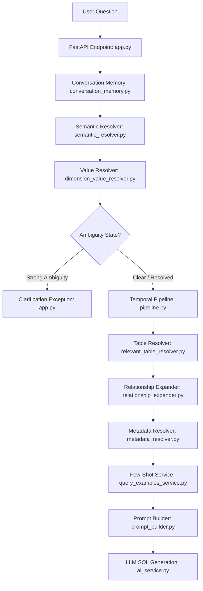

# Semantic Plan Foundation Audit

## 1. Executive Verdict
Based on this read-only forensic audit, the current conversational pipeline **already resolves and contains all essential semantic components** required to build a single, authoritative **Semantic Plan** before generating SQL. 

Specifically:
- **Metrics, Dimensions, and Values** are successfully mapped to columns and tables by the metadata registry and value-index matchers.
- **Temporal context** is fully computed as structured date boundaries and SQL filters.
- **Table and relationship constraints** are evaluated and mapped using schema metadata and relationship bridges.

However, these structured outputs are currently **decoupled and serialized into raw markdown prompt text** for the LLM to compile during generation. The final assembly of queries (joins, selections, grouping, aggregations) is left entirely to the LLM. 
- **Sufficiency**: **HIGHLY SUFFICIENT** at the raw element level; **INSUFFICIENT** at the structural coordination layer.
- **Architectural Verdict**: Implementing a unified Semantic Plan layer will not duplicate logic, but rather **reify and centralize existing outputs** into a strict logical query plan contract, preventing LLM reasoning drift.

---

## 2. Current Question Pipeline
The system processes questions through a well-defined sequence. Here is the trace of the transition pipeline:



### Transition Trace Details
1. **Question**: Raw input string.
   - *File/Function*: `backend/app.py` -> [`ask_question`](file:///d:/Projects/Ramraj-AI-Chatbot/backend/app.py#L344)
   - *Input*: `question: str`, `session_id: int`
   - *Output*: JSON API response
   - *Source of Truth*: Client request
   - *Transformation*: None.
   - *Risk*: Lost trailing spaces or conversational fillers are stripped downstream.

2. **Conversation Context**: History list.
   - *File/Function*: `backend/services/conversation_memory.py` -> `get_history`
   - *Input*: `employee_id`, `session_id`
   - *Output*: List of past turns (question, SQL query, semantic context dict)
   - *Source of Truth*: SQLite `chat_messages` table
   - *Transformation*: Deserialization of semantic context JSON.
   - *Risk*: Horizontal worker scaling without shared cache can drop active states.

3. **Temporal Resolution**: Intent and date resolution.
   - *File/Function*: `backend/semantic/temporal/pipeline.py` -> [`TemporalPipeline.build`](file:///d:/Projects/Ramraj-AI-Chatbot/backend/semantic/temporal/pipeline.py#L48)
   - *Input*: `question`, `connection_id`, `settings`
   - *Output*: Raw string (`{temporal_section}`) representing time boundaries and pre-rendered SQL rules.
   - *Source of Truth*: Regex rules, dynamic reference date calculations.
   - *Transformation*: Text pattern classification and arithmetic date mapping.
   - *Risk*: Pre-rendered SQL rules in `TemporalPromptFormatter` might conflict with SQL dialect rules if not isolated.

4. **Semantic Retrieval**: Matching business names and synonyms.
   - *File/Function*: `backend/semantic/semantic_resolver.py` -> [`SemanticResolver.resolve`](file:///d:/Projects/Ramraj-AI-Chatbot/backend/semantic/semantic_resolver.py#L300)
   - *Input*: `connection_id`, `question`, `clarified_candidate`, `previous_semantic_context`
   - *Output*: Dictionary of resolved metrics, dimensions, values, and retrieval telemetry.
   - *Source of Truth*: Platform tables `semantic_metrics` and `semantic_dimensions`.
   - *Transformation*: Exact and fuzzy synonym string overlap matching.
   - *Risk*: Short-token synonym overlaps can cause high-cardinality collisions.

5. **Value Resolution**: Parsing search terms in the question against table cells.
   - *File/Function*: `backend/semantic/dimension_value_resolver.py` -> [`DimensionValueResolver.resolve_matches`](file:///d:/Projects/Ramraj-AI-Chatbot/backend/semantic/dimension_value_resolver.py#L156)
   - *Input*: `connection_id`, `question`, `dimension_context`, `previous_semantic_context`
   - *Output*: `ResolutionResultList` containing parsed and validated database values.
   - *Source of Truth*: Table `dimension_value_index`
   - *Transformation*: RapidFuzz/fuzzy string matchers.
   - *Risk*: Distinct values exceeding 5,000 are skipped during building, causing silent mismatches.

6. **Ambiguity / Clarification**: Throwing/handling ambiguity states.
   - *File/Function*: `backend/semantic/matching/models.py` -> `AmbiguityClassifier.classify`
   - *Input*: Candidate lists, tokens
   - *Output*: `SemanticResolutionResult` with status (e.g., `STRONG_AMBIGUITY`)
   - *Source of Truth*: Classifiers
   - *Transformation*: Candidate scores and query token coverage checks.
   - *Risk*: Tight UI coupling with the payload means changes break option card rendering.

7. **Table Selection**: Identifying candidate tables.
   - *File/Function*: `backend/semantic/relevant_table_resolver.py` -> [`RelevantTableResolver.resolve`](file:///d:/Projects/Ramraj-AI-Chatbot/backend/semantic/relevant_table_resolver.py#L8)
   - *Input*: `semantic_result` dict
   - *Output*: List of tables sorted by relevance scores (Metrics=5, Dimensions=3, Values=2).
   - *Source of Truth*: Mapped columns of metrics, dimensions, and values.
   - *Transformation*: Affine scoring.
   - *Risk*: Does not check if tables are connectable.

8. **Relationship Expansion**: Bridging disconnected tables.
   - *File/Function*: `backend/semantic/relationship_expander.py` -> [`RelationshipExpander.expand`](file:///d:/Projects/Ramraj-AI-Chatbot/backend/semantic/relationship_expander.py#L8)
   - *Input*: `connection_id`, `tables`
   - *Output*: List of tables including bridge tables (e.g. `[{"table_name": "T1", "is_bridge": False}]`).
   - *Source of Truth*: `schema_relationships` table.
   - *Transformation*: BFS path search in connection graph.
   - *Risk*: Databases lacking foreign key metadata yield disconnected tables, causing joins to fail.

9. **Prompt Builder**: Translating structures to prompt instructions.
   - *File/Function*: `backend/ai/prompt_builder.py` -> [`PromptBuilder.build_sql_prompt`](file:///d:/Projects/Ramraj-AI-Chatbot/backend/ai/prompt_builder.py#L138)
   - *Input*: Resolved entities, rules, database schema texts, compatible few-shots.
   - *Output*: Text prompt string.
   - *Source of Truth*: Formatter classes and prompt template.
   - *Transformation*: Serializing structures to Markdown blocks.
   - *Risk*: Extremely large database schemas bloat prompts, causing LLM context decay.

10. **LLM SQL Generation**: Converting prompt to SQL.
    - *File/Function*: `backend/ai/ai_service.py` -> [`generate_sql_query`](file:///d:/Projects/Ramraj-AI-Chatbot/backend/ai/ai_service.py#L69)
    - *Input*: Compiled text prompt.
    - *Output*: Raw SQL query string.
    - *Source of Truth*: LLM output.
    - *Transformation*: Text generation.
    - *Risk*: High vulnerability to reasoning drift and invalid column guessing.

---

## 3. Intent Inventory
The current system resolves user business intent **implicitly** rather than structurally.
- **Status**: **PARTIAL / INFERRED**
- **Details**:
  - `classify_intent` in [`intent_classifier.py`](file:///d:/Projects/Ramraj-AI-Chatbot/backend/ai/intent_classifier.py#L35) only returns `ANALYTICS` vs `GENERAL`. It does not classify operations (growth, aggregate, lookup).
  - The system **inferred** intent types as listed below:
    - **aggregate**: **INFERRED** (Prompt builder tells LLM to summarize; SQL rules define aggregation type).
    - **detail**: **INFERRED** (LLM infers it based on absence of aggregate keywords).
    - **trend**: **INFERRED** (DataShapeClassifier classifies it *after* execution to choose chart templates).
    - **comparison**: **INFERRED** (Classified *after* execution).
    - **ranking / top-N**: **INFERRED** (Identified post-execution via DataShapeClassifier).
    - **distribution**: **UNKNOWN**.
    - **growth / degrowth**: **UNKNOWN**.
    - **filter / lookup**: **INFERRED**.
  - **Architectural Gap**: Because query intent is not classified pre-SQL, the LLM has to make structural decisions (e.g. when to apply `GROUP BY` or write a window function) on its own.

---

## 4. Metric Contract
Metrics are represented structurally in metadata:
- **Status**: **CONFIRMED**
- **Table**: `semantic_metrics`
- **Fields**: `metric_name`, `business_name`, `table_name`, `column_name`, `aggregation_type`, `synonyms`.
- **Representative Examples**:
  - **C Y (Current Year Sales)**:
    - *Identifier*: `C Y`
    - *Physical Column*: `CY` on `QB_MDJMD_SALES_5YRS_SUMMARY`
    - *Aggregation*: `SUM`
  - **P Y (Previous Year Sales)**:
    - *Identifier*: `P Y`
    - *Physical Column*: `PY` on `QB_MDJMD_SALES_5YRS_SUMMARY`
    - *Aggregation*: `SUM`
  - **Qty (Quantity)**:
    - *Identifier*: `Qty`
    - *Physical Column*: `Qty` on `PBI_ENES_ORDER_PENDING_SUMMARY`
    - *Aggregation*: `SUM`
  - **billamt**:
    - *Identifier*: `billamt`
    - *Physical Column*: `billamt` on `PBI_OUTSTANDING_ENES_SUMMARY`
    - *Aggregation*: `SUM`
- **Defect Mapping**: `Doc Month` is incorrectly registered in `semantic_metrics` as a metric with aggregation `None`, instead of `semantic_dimensions` as a calendar dimension.
- **Verdict**: Aggregation type is authoritative in metadata, but not structurally enforced in a pre-SQL query plan.

---

## 5. Dimension Contract
Dimensions are stored in metadata:
- **Status**: **CONFIRMED**
- **Table**: `semantic_dimensions`
- **Fields**: `dimension_name`, `business_name`, `table_name`, `column_name`, `semantic_category`, `synonyms`.
- **Representative Examples**:
  - **City**: Mapped to `City` column on `PBI_OUTSTANDING_ENES_SUMMARY`.
  - **Brand**: Mapped to `Brand` column on `PBI_ENES_ORDER_PENDING_SUMMARY`.
  - **Division**: Mapped to `Division` column on all 3 summary tables.
  - **Category**: Mapped to `Category` column on all 3 summary tables.
- **Verdict**: Dimension schemas are structurally modeled, but their join path mappings (when columns exist across tables) are duplicated and resolved on the fly during BFS expansions.

---

## 6. Value / Filter Contract
Values are resolved prior to prompting:
- **Status**: **CONFIRMED**
- **Runtime Structure**: Mapped as `value_matches` list containing dictionaries of:
  `{dimension_id, business_name, table_name, column_name, value, normalized_value, match_type}`
- **Examples**:
  - `"LS ZARI COTTON"` resolves to `Brand = 'LS ZARI COTTON'`
  - `"CHENNAI"` resolves to `City = 'CHENNAI'` or `District = 'CHENNAI'` (triggers ambiguity).
- **Verdict**: A resolved value is represented canonically enough to form a complete `table_name.column_name = value` filter expression. However, the system currently prints this in the prompt as a list and relies on the LLM to write the exact SQL filter.

---

## 7. Temporal Contract
The temporal engine computes time filters:
- **Status**: **CONFIRMED**
- **Runtime Structure**: Mapped as `TimeContext` and `ResolvedTimePlan` containing:
  `{strategy, date_column, calendar_table, snapshot_columns, start_date, end_date, grouping, comparison}`
- **Examples**:
  - `"last year"` resolves to `start_date = '2025-01-01'`, `end_date = '2025-12-31'`, and generates the pre-rendered SQL rule `YEAR(createddate) = YEAR(DATEADD(year, -1, GETDATE()))`.
- **Verdict**: The temporal output contains all calculations and pre-rendered clauses needed to attach directly to a Semantic Plan.

---

## 8. Aggregation Contract
Aggregation is driven by the metadata registry:
- **Status**: **CONFIRMED**
- **Details**:
  - `aggregation_type` is read from `semantic_metrics` (e.g. `SUM` for sales/quantities).
  - Metrics with `None` (like identifiers `Sno` or `OrderNo`) do not have default aggregations.
- **Defect Risk**: PromptBuilder heuristics tell the LLM to aggregate columns, but there is no compiler layer that structurally forces the generated query to use `SUM(CY)` instead of raw `CY`.

---

## 9. Query Shape Contract
Query shape is **post-execution only**:
- **Status**: **SUSPECTED DEFECT**
- **Details**:
  - [`DataShapeClassifier`](file:///d:/Projects/Ramraj-AI-Chatbot/backend/ai/insights/data_shape_classifier.py#L4) determines the query layout (e.g. `TREND`, `COMPARISON`, `SINGLE_VALUE`) **after execution** based on row counts and column names.
  - There is no pre-SQL query shape planning.
  - **Verdict**: This is an architectural gap. If the query shape were decided before SQL generation, it could enforce `GROUP BY` clauses and row limits structurally.

---

## 10. Business Domain / Table Role Contract
The system understands table metadata:
- **Status**: **CONFIRMED**
- **Details**:
  - `schema_tables` catalog contains `business_name` and `description` for each table:
    - `PBI_ENES_ORDER_PENDING_SUMMARY`: pending orders.
    - `PBI_OUTSTANDING_ENES_SUMMARY`: outstanding balances.
    - `QB_MDJMD_SALES_5YRS_SUMMARY`: historical sales.
- **Verdict**: The system differentiates tables based on synonym overlays (e.g., matching "pending" routes queries to `PBI_ENES_ORDER_PENDING_SUMMARY`, matching "sales" routes to `QB_MDJMD_SALES_5YRS_SUMMARY`). However, the table grains and preferred dimensions are not defined structurally.

---

## 11. Table Selection Contract
`RelevantTableResolver` ranks tables:
- **Status**: **CONFIRMED**
- **Structure**: Mapped as:
  `[{"table_name": "QB_MDJMD_SALES_5YRS_SUMMARY", "score": 8.0}, ...]`
- **Verdict**: The resolver successfully determines table priorities and scoring. This ranked list can be embedded directly in a Semantic Plan.

---

## 12. Join Contract
Join mapping is computed on the fly:
- **Status**: **CONFIRMED**
- **Details**:
  - [`RelationshipExpander`](file:///d:/Projects/Ramraj-AI-Chatbot/backend/semantic/relationship_expander.py) resolves table links.
  - [`RelationshipContextService`](file:///d:/Projects/Ramraj-AI-Chatbot/backend/semantic/relationship_context_service.py) renders INNER JOIN string blocks.
- **Verdict**: The relationship engine already has the keys needed to compile a join plan. However, it is printed as text inside the prompt, relying on the LLM to recompile it.

---

## 13. Ambiguity Contract
Ambiguity classification operates correctly:
- **Status**: **CONFIRMED**
- **Structure**: Mapped as `SemanticResolutionResult` carrying candidates and ambiguity status (`SINGLE_MATCH`, `STRONG_AMBIGUITY`).
- **Verdict**: The contract is sufficient for user clarification cards, but operates independently of SQL planning.

---

## 14. Context Contract
State context is managed across turns:
- **Status**: **PARTIALLY CONFIRMED**
- **Details**:
  - `previous_semantic_context` is extracted from conversation history.
  - Dimension inheritance works (e.g.Turn 1: "sales in Chennai" -> Turn 2: "for Coimbatore" inherits Chennai's dimension type).
- **Verdict**: Conversation context is available but parsed on the fly. It is not saved as a structured semantic state.

---

## 15. PromptBuilder Contract
`PromptBuilder` acts as a text serializer:
- **Status**: **CONFIRMED**
- **Inputs**: Mapped raw strings of schema text, SQL expressions, metadata rules, required value filters, and temporal contexts.
- **Verdict**: `PromptBuilder` recomputes several rules (like converting metadata structures to markdown tables and rewriting SQL mapping lists). It acts as a text renderer rather than a compiler.

---

## 16. Few-Shot Contract
Few-shot examples are filtered dynamically:
- **Status**: **CONFIRMED**
- **Details**:
  - `QueryExamplesService.retrieve` filters examples based on table overlaps, resolved value columns, and period columns.
  - This prevents conflicting period examples (e.g., `PY` example overriding `CY` query) from polluting the prompt.
- **Verdict**: Filtering is functional, but does not evaluate dimension structure compatibility.

---

## 17. SQL Boundary
The transition boundary is located in `generate_sql_query`:
- **Status**: **CONFIRMED**
- **Details**:
  - The transition occurs when `PromptBuilder` outputs the formatted Markdown prompt string and sends it to `LLMExecutionService`.
  - At this boundary, **almost all elements** (metrics, filters, joins, temporal calculations) are already resolved.
  - **Missing Elements**: The compiler lacks a unified logical query plan representing the SQL query structure, requiring the LLM to handle syntax construction.

---

## 18. Multiple Sources of Truth
The audit revealed several duplication risks:
- **Metric Mapping**:
  - *Source A*: `SemanticResolver` (resolves column and table).
  - *Source B*: LLM (can select alternative columns from schema).
  - *Conflict Risk*: Medium.
  - *Owner*: `SemanticResolver` (should force selection in logical plan).
- **Aggregations**:
  - *Source A*: Metadata `aggregation_type`.
  - *Source B*: LLM and few-shot examples.
  - *Conflict Risk*: High.
  - *Owner*: Metadata registry (should compile aggregate function in plan).
- **Time Calculations**:
  - *Source A*: `TemporalPipeline` (calculates start/end dates).
  - *Source B*: LLM (can write alternative date calculations).
  - *Conflict Risk*: Medium.
  - *Owner*: `TemporalPipeline`.
- **Table Joins**:
  - *Source A*: `RelationshipExpander` ( BFS paths).
  - *Source B*: LLM (can invent join conditions).
  - *Conflict Risk*: High.
  - *Owner*: `RelationshipExpander`.

---

## 19. Historical Bug Mapping
- **Banian / Banians Mismatch**:
  - *Stage*: Value Resolution.
  - *Status*: Fixed (via SingularPluralMatcher and sanitization). Prevents recurrence: Yes.
- **Growth / Degrowth**:
  - *Stage*: Intent Classification / Temporal.
  - *Status*: Unsupported. Still reproducible: Yes.
- **Chennai Duplicate Ambiguity**:
  - *Stage*: Ambiguity.
  - *Status*: Fixed (Chennai matches both City and District; triggers option selection). Prevents recurrence: Yes.
- **"for coimbatore" Follow-Up Failure**:
  - *Stage*: Memory / Context.
  - *Status*: Fixed (via followup dimension context inheritance). Prevents recurrence: Yes.
- **Show Sales Trend (Conflicting Period Metric)**:
  - *Stage*: Few-shot filtering.
  - *Status*: Fixed (excludes incompatible examples). Prevents recurrence: Yes.
- **Raw CY instead of SUM(CY)**:
  - *Stage*: Aggregation.
  - *Status*: Heuristics only. Still reproducible: Yes.

---

## 20. New Database Genericity
Compatibility classification for dynamic datasources:
- **new database**: **REQUIRES CONFIGURATION** (requires syncing tables/columns/relationships).
- **new table**: **REQUIRES CONFIGURATION**.
- **new numeric column**: **REQUIRES CONFIGURATION** (requires updating `semantic_metrics`).
- **new date column**: **REQUIRES CONFIGURATION** (requires expanding date dimensions).
- **duplicate values**: **CONFIRMED** (handled via ambiguity resolution).
- **no FK**: **EXPECTED TO FAIL** (join paths cannot be resolved).
- **multiple FK paths**: **PARTIALLY CONFIRMED** (BFS selects the first path, which might be incorrect).
- **high-cardinality dimension**: **EXPECTED TO FAIL** (value indexing skips columns with > 5000 distinct values).

---

## 21. Proposed Canonical Semantic Plan
The proposed canonical Semantic Plan structure is outlined below. This structure compiles all outputs into a single intermediate logical layout:

```json
{
  "intent": "AGGREGATE | DETAIL | TREND | COMPARISON",
  "metrics": [
    {
      "metric_id": "string",
      "column_name": "string",
      "table_name": "string",
      "aggregation": "SUM | COUNT | AVG | NONE"
    }
  ],
  "dimensions": [
    {
      "dimension_id": "string",
      "column_name": "string",
      "table_name": "string",
      "sql_expression": "string | null"
    }
  ],
  "filters": [
    {
      "table_name": "string",
      "column_name": "string",
      "operator": "string",
      "value": "any"
    }
  ],
  "temporal": {
    "strategy": "SNAPSHOT | DATE_COLUMN | FISCAL",
    "date_column": "string | null",
    "start_date": "string | null",
    "end_date": "string | null",
    "sql_rule": "string | null",
    "granularity": "string | null"
  },
  "tables": {
    "target_tables": ["string"],
    "bridge_tables": ["string"]
  },
  "joins": [
    {
      "left_table": "string",
      "left_column": "string",
      "right_table": "string",
      "right_column": "string"
    }
  ]
}
```

---

## 22. Backward Compatibility
Integrating the Semantic Plan requires **no database migrations or API changes**:
1. **Pipeline**: `generate_sql_query` compiles the plan from resolver outputs.
2. **Serialization**: `PromptBuilder` is refactored to accept the plan directly, formatting it as strict generation directives.
3. **Execution**: Downstream validators, RLS, and CLS remain unchanged.

---

## 23. Required Implementation Steps
The three smallest steps to implement the Semantic Plan foundation:
1. **Define Schema & Model**: Create `backend/semantic/models/semantic_plan.py` containing the Pydantic plan representation.
2. **Build Plan Compiler**: Create `backend/semantic/semantic_plan_compiler.py` to assemble the resolver, temporal, table, and join outputs into the plan.
3. **Refactor PromptBuilder**: Modify `PromptBuilder` to accept the Semantic Plan object and format it into strict SQL generation instructions.

---

## 24. Required Test Matrix
Test scenarios to validate semantic planning correctness:
- **Metric Verification**: Validate aggregations for `Amt`, `billamt`, `due`, and `Qty`.
- **Value Matching**: Test value lookups for `Unibro`, `Banians`, `Chennai`, `Marketing`, and `LS ZARI COTTON`.
- **Temporal Verification**: Validate calculations for current year, last year, comparison, and YTD.
- **Intent Verification**: Test aggregate, comparison, and trend queries.
- **Ambiguity Verification**: Verify handling of duplicate values and cross-dimension matches.

---

## 25. Unknowns / Risks
- **Dialect Portability**: Pre-rendered SQL rules inside the plan may fail if executed on databases other than MS SQL Server.
- **Join Path Resolution**: Summary tables lacking foreign keys require manual relationships; otherwise, join planning will fail.

---

## 26. Final Recommendation
- **Authority**: The semantic plan must become the **single source of truth** passed to the SQL generator.
- **Constraint**: Instruct the LLM that it is not allowed to select columns, perform joins, or apply filters outside the Semantic Plan.
- **Next Steps**: Proceed with Phase 1A model definition and plan compiler implementation.
